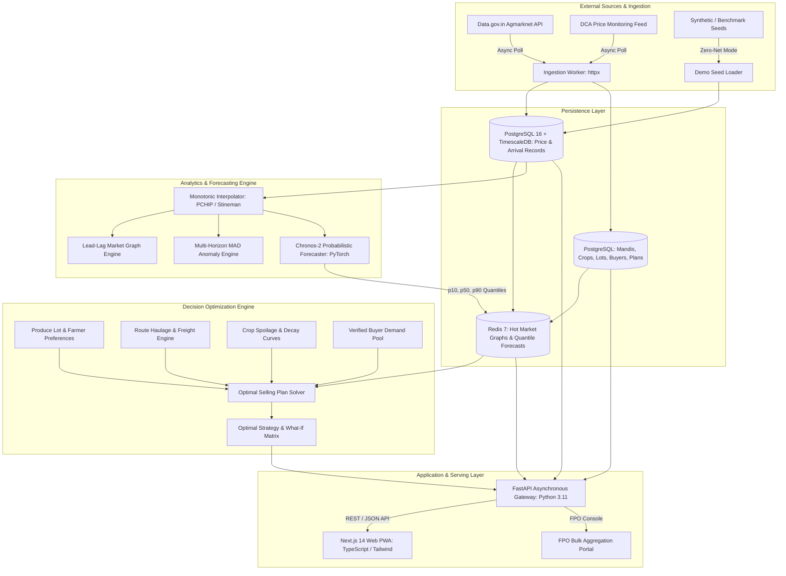
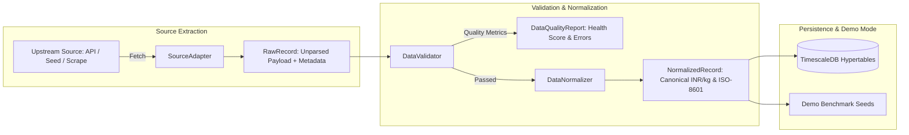
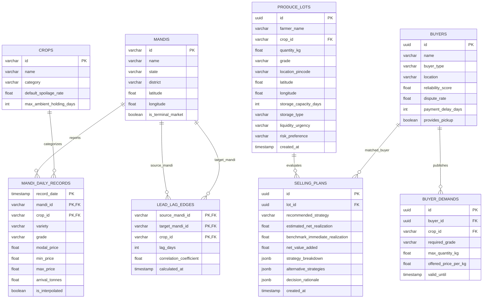
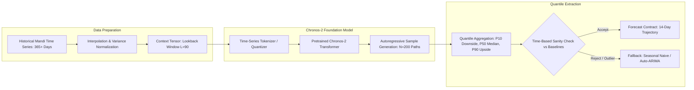
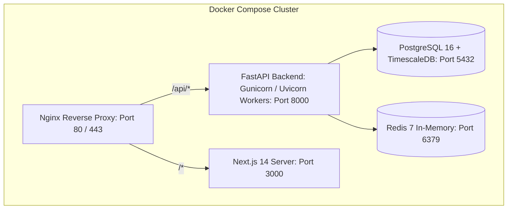

# AGRI-LINK AI: System Architecture & Technical Design

> **Document Type**: Technical Architecture & System Design Document (SDD)  
> **Problem Statement**: SIH26132 — Strengthening Market Linkages and Price Discovery for Farmers  
> **Engineering Benchmark**: Institutional depth, modularity, and operational rigor modeled after [darkinspect](https://github.com/Shubhisingh16/darkinspect)

---

## 1. Architectural Principles & System Design Philosophy

The architecture of **AGRI-LINK AI** is engineered around five fundamental tenets designed to eliminate the fragility, technical debt, and tight file-level couplings observed in prior academic systems:

1. **Decoupled Three-Tier Topology**:  
   The application strictly separates **Data Ingestion/ETL**, **Analytical/Optimization Services**, and **Client Presentation**. Analytical pipelines never block API request-response threads.
2. **Clean-Room Boundary & IP Firewall**:  
   Zero code, dependencies, or scripts are imported or vendored from the reference research repositories. All mathematical formulations (Stineman monotonic interpolation, Median Absolute Deviation outlier detection, lead-lag cross-correlation, Kahneman-Tversky prospect theory) are implemented clean-room using modern, vectorized, and strictly typed libraries.
3. **Database-Backed Time-Series Persistence**:  
   File-based CSV manipulation during web requests (the fatal flaw of legacy prototypes) is completely eliminated. All historical and forecasted time series reside in **PostgreSQL 16** with **TimescaleDB** hypertables, indexed by `(mandi_id, commodity_id, date)`.
4. **Separation of Probabilistic ML from Business Optimization**:  
   Machine learning foundation models (Amazon Chronos-2) forecast probability distributions of future market prices and arrivals. The **Optimization Engine** consumes these distributions alongside concrete, deterministic logistics costs, storage decay functions, and farmer preference vectors to compute Net Realizable Value (NRV).
5. **Deterministic Offline Demo Parity**:  
   The platform features a zero-dependency, self-contained **Demo Mode** with pre-seeded, verified benchmark datasets for the Chandigarh agricultural cluster, guaranteeing zero network latency or third-party service failures during evaluation.

---

## 2. High-Level System Architecture



---

## 3. Backend Service Architecture (FastAPI)

The backend is built with **FastAPI** on Python 3.11+, leveraging `pydantic-v2` for input/output data contract enforcement and `asyncio` for non-blocking IO.

### 3.1 Directory Structure & Layering
```
backend/app/
├── api/
│   └── v1/
│       ├── endpoints/
│       │   ├── lots.py          # /api/v1/lots (CRUD for produce lots)
│       │   ├── markets.py       # /api/v1/markets (Mandi listings, arrivals, prices)
│       │   ├── forecast.py      # /api/v1/forecast (Chronos-2 quantile distributions)
│       │   ├── graph.py         # /api/v1/graph (Directed lead-lag market network)
│       │   ├── buyers.py        # /api/v1/buyers (Buyer demand matching)
│       │   ├── optimizer.py     # /api/v1/optimizer (Optimal Selling Plan solver)
│       │   ├── simulator.py     # /api/v1/simulator (Interactive sensitivity engine)
│       │   ├── fpo.py           # /api/v1/fpo (FPO aggregation & bulk dispatch)
│       │   └── demo.py          # /api/v1/demo (Demo scenario controls & reset)
│       └── router.py            # API v1 route aggregator
│
├── core/
│   ├── config.py                # Environment configuration (Pydantic BaseSettings)
│   ├── database.py              # SQLAlchemy 2.0 async engine & sessionmaker
│   ├── redis.py                 # Redis connection pool & cache decorator
│   ├── exceptions.py            # Domain-specific exception handlers
│   └── logging.py               # Structured JSON logger
│
├── db/
│   ├── models/                  # SQLAlchemy ORM declarative models
│   │   ├── market.py            # Mandi & state geographic models
│   │   ├── price_record.py      # Daily market price hypertable
│   │   ├── produce_lot.py       # Farmer produce lots & specs
│   │   ├── buyer.py             # Buyers, demands, and reliability scores
│   │   └── selling_plan.py      # Generated plans & audit trails
│   └── seeds/                   # Verified benchmark seed data for Demo Mode
│
├── schemas/                     # Pydantic v2 validation contracts
│   ├── lot.py                   # Produce lot request/response schemas
│   ├── market.py                # Market, price, and arrival schemas
│   ├── forecast.py              # Probabilistic quantile schemas
│   ├── buyer.py                 # Buyer matching & score decomposition
│   └── plan.py                  # Selling plan & what-if schemas
│
└── services/                    # Pure domain logic & algorithms
    ├── data_cleaning/           # Monotonic interpolation & MAD anomaly detection
    ├── forecasting/             # Chronos-2 runner & baseline benchmarks
    ├── graph/                   # Dynamic lead-lag cross-correlation graph
    ├── perishability/           # Crop decay and quality downgrade models
    ├── logistics/               # Freight calculation & route distance matrix
    └── optimizer/               # NRV computation & split strategy solver
```

### 3.2 Data Pipeline Architecture & Ingestion Contracts

To guarantee that agricultural data entering AgriClutch is clean, uniform, and legally sound, the pipeline enforces a strictly typed, three-stage lifecycle decoupling source extraction, validation/normalization, and storage:



#### 3.2.1 Typed Data Pipeline Interfaces

```python
from abc import ABC, abstractmethod
from typing import List, Dict, Any, Optional
from datetime import date, datetime
from pydantic import BaseModel, Field, ConfigDict

class RawRecord(BaseModel):
    """Raw unprocessed record container emitted by upstream source adapters."""
    source_identifier: str = Field(..., description="Origin source name (e.g., 'agmarknet_api', 'benchmark_seed')")
    payload: Dict[str, Any] = Field(..., description="Raw dictionary representation prior to normalization")
    captured_at: datetime = Field(default_factory=datetime.utcnow)

class NormalizedRecord(BaseModel):
    """Canonical, strongly typed record preserving source provenance and standardized rates."""
    model_config = ConfigDict(frozen=True)

    observation_id: str
    source_name: str
    source_record_id: Optional[str] = None
    source_market_id: str
    source_commodity_id: str
    market_id: str
    commodity_id: str
    record_date: date
    variety: str = "Common"
    grade: str = "FAQ"
    original_modal_price: float = Field(..., gt=0.0)
    original_min_price: float = Field(..., gt=0.0)
    original_max_price: float = Field(..., gt=0.0)
    original_price_unit: str
    normalized_modal_price: float = Field(..., gt=0.0)
    normalized_min_price: float = Field(..., gt=0.0)
    normalized_max_price: float = Field(..., gt=0.0)
    normalized_price_unit: str = "INR_PER_KG"
    arrival_tonnes: float = Field(default=0.0, ge=0.0)
    is_interpolated: bool = False
    is_outlier: bool = False

class DataQualityReport(BaseModel):
    """Comprehensive dataset health scorecard produced prior to storage ingestion."""
    batch_id: str
    total_records: int
    valid_records: int
    rejected_records: int
    duplicate_count: int
    zero_price_count: int
    outlier_count: int
    missing_dates_count: int
    health_score: float = Field(..., ge=0.0, le=100.0)
    status: str = Field(..., description="'PASS', 'WARN', or 'REJECT'")
    errors: List[str] = Field(default_factory=list)

class SourceAdapter(ABC):
    """Abstract contract for extracting data from external agricultural feeds or benchmark seeds."""

    @property
    @abstractmethod
    def source_name(self) -> str:
        """Unique identifier for the adapter."""
        pass

    @abstractmethod
    async def fetch_raw_records(
        self,
        commodity: str,
        start_date: date,
        end_date: date,
        market: Optional[str] = None,
    ) -> List[RawRecord]:
        """Fetch raw records matching criteria."""
        pass

    @abstractmethod
    async def test_connectivity(self) -> bool:
        """Test upstream reachability."""
        pass

class DataValidator(ABC):
    """Evaluates raw records against domain bounds and formats quality audit reports."""

    @abstractmethod
    def validate_and_normalize(
        self,
        raw_records: List[RawRecord],
    ) -> tuple[List[NormalizedRecord], DataQualityReport]:
        """Validates bounds, strips merge artifacts, normalizes units to INR/kg, and emits health scorecard."""
        pass
```

---

## 4. Frontend Architecture (Next.js 14 App Router)

The frontend is constructed with **Next.js 14**, **TypeScript 5 (Strict Mode)**, and **Tailwind CSS**, designed for high-contrast accessibility and mobile-first responsiveness.

```
frontend/src/
├── app/
│   ├── layout.tsx               # Root layout, theme provider, query client
│   ├── page.tsx                 # Landing & platform overview
│   ├── dashboard/page.tsx       # Farmer intelligence console
│   ├── lot/new/page.tsx         # Produce lot creation wizard
│   ├── plan/[id]/page.tsx       # Optimal Selling Plan visualization
│   ├── simulator/page.tsx       # What-If sensitivity lab
│   ├── markets/page.tsx         # Mandi comparison & lead-lag map
│   └── fpo/page.tsx             # FPO cooperative aggregation portal
│
├── components/
│   ├── ui/                      # Design system primitives (Button, Card, Slider, Badge)
│   ├── charts/                  # Recharts wrappers (ForecastQuantileChart, PriceHistoryChart)
│   ├── maps/                    # MapLibre GL market routing & spatial network visualizer
│   ├── forms/                   # LotCreationForm, FarmerPreferencesForm, SimulatorControls
│   └── plan/                    # StrategyCard, NRVBreakdownTable, TransparentBuyerCard
│
├── hooks/                       # Custom hooks (useForecast, useSimulation, useMarkets)
├── lib/                         # Axios/fetch API client, formatters, currency helpers
└── types/                       # Shared TypeScript interfaces matching Pydantic schemas
```

### Component State & Data Flow
- **Server Components**: Used by default for initial page loads, metadata extraction, and static layout generation.
- **Client Components (`'use client'`)**: Isolated strictly to interactive leaves (sliders, lot creation wizard, dynamic What-If simulator, and Recharts components).
- **Client Cache**: TanStack React Query handles background revalidation and cache deduplication.
- **Local State**: Lightweight Zustand store for ephemeral lot creation state and simulator parameter adjustments.

---

## 5. Database Schema & Persistence Architecture

The persistence layer uses **PostgreSQL 16** enhanced with **TimescaleDB** for high-performance time-series querying.



### 5.1 DDL Specifications (PostgreSQL 16)

```sql
-- Mandis Master Table
CREATE TABLE mandis (
    id VARCHAR(32) PRIMARY KEY,
    name VARCHAR(128) NOT NULL,
    state VARCHAR(64) NOT NULL,
    district VARCHAR(64) NOT NULL,
    latitude DOUBLE PRECISION NOT NULL,
    longitude DOUBLE PRECISION NOT NULL,
    is_terminal_market BOOLEAN DEFAULT FALSE,
    created_at TIMESTAMPTZ DEFAULT NOW()
);

-- Crops Master Table
CREATE TABLE crops (
    id VARCHAR(32) PRIMARY KEY,
    name VARCHAR(64) NOT NULL UNIQUE,
    category VARCHAR(32) NOT NULL, -- 'perishable', 'semi_perishable', 'cereal', 'pulse'
    default_spoilage_rate DOUBLE PRECISION NOT NULL, -- daily decay delta
    max_ambient_holding_days INT NOT NULL,
    created_at TIMESTAMPTZ DEFAULT NOW()
);

-- Time-Series Hypertable for Market Prices & Arrivals (Surrogate PK with Natural Unique Index)
CREATE TABLE mandi_daily_records (
    observation_id UUID PRIMARY KEY DEFAULT gen_random_uuid(),
    source_name VARCHAR(64) NOT NULL,
    source_record_id VARCHAR(128),
    source_market_id VARCHAR(128) NOT NULL,
    source_commodity_id VARCHAR(128) NOT NULL,
    record_date DATE NOT NULL,
    mandi_id VARCHAR(32) NOT NULL REFERENCES mandis(id),
    crop_id VARCHAR(32) NOT NULL REFERENCES crops(id),
    variety VARCHAR(64) NOT NULL DEFAULT 'Common',
    grade VARCHAR(16) NOT NULL DEFAULT 'FAQ',
    original_modal_price DOUBLE PRECISION NOT NULL,
    original_min_price DOUBLE PRECISION NOT NULL,
    original_max_price DOUBLE PRECISION NOT NULL,
    original_price_unit VARCHAR(32) NOT NULL,
    normalized_modal_price DOUBLE PRECISION NOT NULL,
    normalized_min_price DOUBLE PRECISION NOT NULL,
    normalized_max_price DOUBLE PRECISION NOT NULL,
    normalized_price_unit VARCHAR(32) NOT NULL DEFAULT 'INR_PER_KG',
    arrival_tonnes DOUBLE PRECISION NOT NULL DEFAULT 0.0,
    is_interpolated BOOLEAN DEFAULT FALSE,
    is_outlier BOOLEAN DEFAULT FALSE,
    created_at TIMESTAMPTZ DEFAULT NOW(),
    CONSTRAINT uq_mandi_daily_natural UNIQUE (record_date, mandi_id, crop_id, variety, grade)
);

-- TimescaleDB Hypertable conversion (if Timescale extension available)
-- SELECT create_hypertable('mandi_daily_records', 'record_date', if_not_exists => TRUE);

CREATE INDEX idx_mandi_daily_query ON mandi_daily_records (crop_id, mandi_id, record_date DESC);

-- Produce Lots Table
CREATE TABLE produce_lots (
    id UUID PRIMARY KEY DEFAULT gen_random_uuid(),
    farmer_name VARCHAR(128) NOT NULL,
    crop_id VARCHAR(32) NOT NULL REFERENCES crops(id),
    quantity_kg DOUBLE PRECISION NOT NULL CHECK (quantity_kg > 0),
    grade VARCHAR(16) NOT NULL DEFAULT 'A',
    location_name VARCHAR(128) NOT NULL,
    latitude DOUBLE PRECISION NOT NULL,
    longitude DOUBLE PRECISION NOT NULL,
    storage_capacity_days INT NOT NULL DEFAULT 0,
    storage_type VARCHAR(32) NOT NULL DEFAULT 'ambient', -- 'ambient', 'cold_storage'
    liquidity_urgency VARCHAR(32) NOT NULL DEFAULT 'balanced', -- 'immediate', 'balanced', 'patient'
    risk_preference VARCHAR(32) NOT NULL DEFAULT 'balanced', -- 'conservative', 'balanced', 'aggressive'
    created_at TIMESTAMPTZ DEFAULT NOW()
);

-- Buyers Master Table
CREATE TABLE buyers (
    id UUID PRIMARY KEY DEFAULT gen_random_uuid(),
    name VARCHAR(128) NOT NULL,
    buyer_type VARCHAR(64) NOT NULL, -- 'retail_chain', 'food_processor', 'mandi_wholesaler', 'exporter'
    location VARCHAR(128) NOT NULL,
    latitude DOUBLE PRECISION NOT NULL,
    longitude DOUBLE PRECISION NOT NULL,
    reliability_score DOUBLE PRECISION NOT NULL DEFAULT 0.95 CHECK (reliability_score BETWEEN 0 AND 1),
    dispute_rate DOUBLE PRECISION NOT NULL DEFAULT 0.02 CHECK (dispute_rate BETWEEN 0 AND 1),
    payment_delay_days INT NOT NULL DEFAULT 1,
    provides_pickup BOOLEAN NOT NULL DEFAULT TRUE,
    created_at TIMESTAMPTZ DEFAULT NOW()
);

-- Active Buyer Demands
CREATE TABLE buyer_demands (
    id UUID PRIMARY KEY DEFAULT gen_random_uuid(),
    buyer_id UUID NOT NULL REFERENCES buyers(id) ON DELETE CASCADE,
    crop_id VARCHAR(32) NOT NULL REFERENCES crops(id),
    required_grade VARCHAR(16) NOT NULL DEFAULT 'A',
    max_quantity_kg DOUBLE PRECISION NOT NULL,
    offered_price_per_kg DOUBLE PRECISION NOT NULL,
    valid_until TIMESTAMPTZ NOT NULL,
    created_at TIMESTAMPTZ DEFAULT NOW()
);

-- Directed Lead-Lag Edges Table
CREATE TABLE lead_lag_edges (
    source_mandi_id VARCHAR(32) NOT NULL REFERENCES mandis(id),
    target_mandi_id VARCHAR(32) NOT NULL REFERENCES mandis(id),
    crop_id VARCHAR(32) NOT NULL REFERENCES crops(id),
    lag_days INT NOT NULL,
    correlation_coefficient DOUBLE PRECISION NOT NULL,
    calculated_at TIMESTAMPTZ DEFAULT NOW(),
    PRIMARY KEY (source_mandi_id, target_mandi_id, crop_id)
);

-- Generated Selling Plans Table
CREATE TABLE selling_plans (
    id UUID PRIMARY KEY DEFAULT gen_random_uuid(),
    lot_id UUID NOT NULL REFERENCES produce_lots(id) ON DELETE CASCADE,
    recommended_strategy VARCHAR(64) NOT NULL,
    estimated_net_realization DOUBLE PRECISION NOT NULL,
    benchmark_immediate_realization DOUBLE PRECISION NOT NULL,
    net_value_added DOUBLE PRECISION NOT NULL,
    strategy_breakdown JSONB NOT NULL,
    alternative_strategies JSONB NOT NULL,
    decision_rationale JSONB NOT NULL,
    created_at TIMESTAMPTZ DEFAULT NOW()
);
```

---

## 6. Machine Learning Infrastructure & Forecasting Engine

The forecasting subsystem operationalizes Amazon **Chronos-2** (a pretrained time-series foundation model based on transformer architectures) as its primary inference engine.



### 6.1 Abstract Forecasting Interface (`BaseForecaster`)
```python
from abc import ABC, abstractmethod
from pydantic import BaseModel
from typing import List
import numpy as np

class ForecastQuantileResult(BaseModel):
    dates: List[str]
    p10: List[float]  # Conservative downside bound
    p50: List[float]  # Median expected trajectory
    p90: List[float]  # Optimistic upside bound
    model_version: str
    confidence_score: float

class BaseForecaster(ABC):
    @abstractmethod
    async def predict(
        self,
        historical_prices: np.ndarray,
        horizon: int = 14,
    ) -> ForecastQuantileResult:
        """Generates probabilistic forecast distribution over target horizon."""
        pass
```

### 6.2 Benchmark Suite & Evaluation Protocol
To prevent unverified claims regarding Chronos-2, the platform includes automated backtesting benchmarks:
1. **Naive Baseline**: $\hat{y}_{t+h} = y_t$.
2. **Seasonal Naive Baseline**: $\hat{y}_{t+h} = y_{t+h-m}$ (where $m=7$ for weekly day-of-week seasonality).
3. **Tabular Gradient Booster**: LightGBM/XGBoost on rolling lag features ($t-1, t-7, t-14$, rolling mean, rolling std).
4. **Chronos-2 (Primary)**: Zero-shot transformer inference.

#### Evaluation Metrics
- **Mean Absolute Error (MAE)**: $\frac{1}{H} \sum_{h=1}^H |y_h - \hat{y}_h|$
- **Mean Absolute Scaled Error (MASE)**: Scaled against historical seasonal naive error.
- **Quantile Loss (Pinball Loss at $\tau = 0.1, 0.5, 0.9$)**: Evaluates the sharpness and calibration of prediction intervals.

---

## 7. Directed Lead-Lag Market Graph Architecture

Markets do not operate in isolation. In agricultural clusters, large terminal wholesale markets (Anchor Mandis, such as Azadpur or Vashi) dictate price discovery. Feeder rural mandis follow terminal trends with physical transit and market awareness lags.

### 7.1 Mathematical Formulation
The market system is modeled as a directed, weighted graph $G = (V, E)$:
- **Vertices ($V$)**: Set of APMC mandis $\{m_1, m_2, \dots, m_n\}$.
- **Edges ($E \subseteq V \times V$)**: Directed edge $(m_i, m_j) \in E$ indicates that price fluctuations in mandi $m_i$ **lead** price movements in mandi $m_j$.
- **Edge Attributes**:
  - `lag_days` ($k^*$): The optimal delay maximizing rolling cross-correlation:
    $$k^* = \arg\max_{k \in [-10, 10]} \text{Corr}(P_i(t), P_j(t - k))$$
  - `weight` ($r^*$): Maximum Pearson correlation coefficient $r(k^*) \in [0.60, 1.0]$.

### 7.2 Anchor vs. Feeder Market Identification
- **Anchor Markets**: Vertices with high out-degree centrality and consistently positive lead lags ($k^* > 0$). Price discovery originates here.
- **Feeder Markets**: Vertices with high in-degree centrality and negative lead lags. Prices here are downstream followers.

---

## 8. Optimization Engine & Solver Pipeline

The optimization engine answers the user's primary question by formulating a multi-objective discrete optimization problem.

```mermaid
flowchart TD
    Lot[Produce Lot Parameters: Qty, Crop, Grade, Shed/Cold, Cash Need, Risk] --> Setup[Initialize Candidate Strategies: 100% Now, 100% Hold, 25/75, 50/50, 75/25]
    
    subgraph Iterative Strategy Evaluation
        Setup --> Loop[For Each Strategy S_k and Horizon t in 1..T_max]
        Loop --> Decay[Calculate Usable Quantity: Q_usable = Q * exp(-delta * t)]
        Decay --> Price[Fetch Forecast Price Distribution: P10, P50, P90]
        Price --> Freight[Calculate Transport & Loading Costs: Dist * Rate]
        Freight --> Storage[Calculate Storage Rental: Q * t * S_rate]
        Storage --> Fees[Calculate APMC Mandi Cess: 1.5% Gross]
        Fees --> Net_NRV[Compute Net Realizable Value: NRV_k]
        Net_NRV --> Risk_Val[Apply Prospect Theory Loss Penalty: lambda = 1.75]
    end
    
    Risk_Val --> Rank[Sort Strategies by Expected Risk-Adjusted Net Realization]
    Rank --> Constraints{Check Feasibility: Cash Need & Storage Limits}
    Constraints -->|Satisfied| Optimal_Plan[Emit Recommended Plan & Alternative Cards]
    Constraints -->|Violated| Prune[Prune Infeasible Strategies & Fallback]
```

### 8.1 Strategy Optimization Matrix
The solver evaluates allocations across two channels ($c_1 = \text{Immediate Verified Buyer}$, $c_2 = \text{Future APMC Mandi Dispatch}$):
$$\mathbf{q} = (q_{\text{now}}, q_{\text{hold}}) \quad \text{such that} \quad q_{\text{now}} + q_{\text{hold}} = Q_{\text{total}}$$

Subject to:
1. **Liquidity Constraint**: $q_{\text{now}} \cdot P_{\text{buyer}} \ge \text{ImmediateCashNeed}$ (if farmer specifies "Immediate").
2. **Physical Storage Constraint**: $t_{\text{hold}} \le \text{MaxStorageDuration}(\text{crop}, \text{storage\_type})$.
3. **Quality Constraint**: Produce held past $T_{\text{downgrade}}$ incurs a quality downgrade discount.

---

## 9. REST API Data Contracts & Endpoint Specifications

### 9.1 `POST /api/v1/lots`
Registers a produce lot and initializes decision parameters.

#### Request Payload
```json
{
  "farmer_name": "Ramesh Kumar",
  "crop": "Tomato",
  "quantity_kg": 500.0,
  "grade": "A",
  "location_name": "Chandigarh Cluster",
  "latitude": 30.7333,
  "longitude": 76.7794,
  "storage_capacity_days": 3,
  "storage_type": "ambient",
  "liquidity_urgency": "balanced",
  "risk_preference": "balanced"
}
```

#### Response Payload (201 Created)
```json
{
  "lot_id": "8f3b2c1a-5d4e-4f6a-9b1c-7e8d9a0b1c2d",
  "crop": "Tomato",
  "quantity_kg": 500.0,
  "grade": "A",
  "created_at": "2026-09-16T08:00:00Z",
  "status": "ANALYZED",
  "recommended_plan_id": "e4d2a1c0-3b5f-4a7e-8c9d-1b2a3c4d5e6f"
}
```

---

### 9.2 `GET /api/v1/forecast/{crop_id}/{mandi_id}`
Returns probabilistic price and arrival trajectories.

#### Response Payload (200 OK)
```json
{
  "crop": "Tomato",
  "mandi_id": "MND_CHANDIGARH_01",
  "mandi_name": "Chandigarh APMC (Sector 26)",
  "horizon_days": 14,
  "dates": ["2026-09-17", "2026-09-18", "2026-09-19", "2026-09-20"],
  "p10_prices": [21.50, 22.00, 23.50, 25.00],
  "p50_prices": [22.00, 23.50, 26.00, 29.50],
  "p90_prices": [23.00, 25.00, 29.00, 34.00],
  "unit": "INR_per_kg",
  "model_info": {
    "engine": "Chronos-2-Small",
    "version": "v1.2",
    "evaluation_mase": 0.74,
    "is_demo_data": true
  }
}
```

---

### 9.3 `GET /api/v1/optimizer/plan/{lot_id}`
Retrieves the completed Optimal Selling Plan with full financial explainability.

#### Response Payload (200 OK)
```json
{
  "plan_id": "e4d2a1c0-3b5f-4a7e-8c9d-1b2a3c4d5e6f",
  "lot_id": "8f3b2c1a-5d4e-4f6a-9b1c-7e8d9a0b1c2d",
  "recommended_strategy": "SPLIT_50_50",
  "headline_summary": "Sell 50% immediately to FreshBazaar; hold 50% for 48 hours for Kalka Mandi dispatch.",
  "financial_summary": {
    "estimated_net_realization": 13425.00,
    "benchmark_immediate_realization": 9200.00,
    "net_value_added": 4225.00,
    "percentage_gain": 45.9
  },
  "tranches": [
    {
      "tranche_index": 1,
      "allocation_kg": 250.0,
      "allocation_percentage": 50.0,
      "timing": "IMMEDIATE",
      "target_channel": "BUYER_DIRECT",
      "target_entity": "FreshBazaar Retail Chain",
      "offered_price_per_kg": 25.50,
      "freight_deduction": 0.0,
      "net_payout": 6375.00,
      "reason": "Satisfies immediate cash requirement; eliminates transport haulage costs."
    },
    {
      "tranche_index": 2,
      "allocation_kg": 250.0,
      "allocation_percentage": 50.0,
      "timing": "HOLD_2_DAYS",
      "target_channel": "MANDI_DISPATCH",
      "target_entity": "Kalka APMC Mandi",
      "expected_price_per_kg": 29.50,
      "projected_spoilage_loss_kg": 4.2,
      "freight_deduction": 280.00,
      "apmc_cess_deduction": 110.00,
      "net_payout": 7050.00,
      "reason": "Captures Himachal Pradesh supply shock price peak before decay threshold."
    }
  ],
  "alternative_strategies": [
    {
      "name": "100% Immediate Sale (Mandi)",
      "estimated_net_realization": 9200.00,
      "risk_profile": "ZERO_RISK",
      "drawback": "Leaves ₹4,225 on the table."
    },
    {
      "name": "100% Hold for 4 Days",
      "estimated_net_realization": 11100.00,
      "risk_profile": "HIGH_RISK",
      "drawback": "High ambient spoilage (>15%) destroys price advantage."
    }
  ]
}
```

---

### 9.4 `POST /api/v1/simulator/simulate`
Dynamically recalculates the optimization surface based on user slider adjustments.

#### Request Payload
```json
{
  "lot_id": "8f3b2c1a-5d4e-4f6a-9b1c-7e8d9a0b1c2d",
  "price_shift_percentage": -15.0,
  "freight_rate_multiplier": 1.2,
  "storage_days_override": 2,
  "risk_preference_override": "conservative"
}
```

#### Response Payload (200 OK)
```json
{
  "recalculated_strategy": "SELL_100_NOW",
  "recalculated_net_realization": 12750.00,
  "shift_from_base": -675.00,
  "adaptation_reason": "Negative price shift (-15%) renders speculative holding unprofitable after factoring decay. 100% liquidation recommended to preserve capital.",
  "is_recalculated_by_backend": true
}
```

---

## 10. Security, Data Governance & Telemetry

1. **Authentication & Authorization**:  
   Stateless JWT authentication with Role-Based Access Control (`ROLE_FARMER`, `ROLE_FPO`, `ROLE_BUYER`, `ROLE_ADMIN`). Farmer phone numbers are authenticated via OTP in production; demo accounts bypass with pre-signed demo tokens.
2. **Data Sanitization & Input Validation**:  
   All string parameters (mandi names, crop IDs) are strictly matched against whitelisted enum tables; coordinates are validated within Indian territorial bounds ($8.0^\circ \text{N} - 37.5^\circ \text{N}$, $68.5^\circ \text{E} - 97.5^\circ \text{E}$).
3. **Audit Trails & Decision Tracking**:  
   Every generated plan logs the input feature vector, model version, timestamp, and resulting strategy into `selling_plans` to enable post-hoc analysis of recommendation accuracy versus realized outcomes.

---

## 11. Deployment, Infrastructure & Demo Execution



### 11.1 Docker Compose Configuration (`docker-compose.yml`)
```yaml
version: '3.8'

services:
  db:
    image: timescale/timescaledb:latest-pg16
    container_name: agrilink-db
    environment:
      POSTGRES_USER: agrilink
      POSTGRES_PASSWORD: agrilink_secure_password
      POSTGRES_DB: agrilink_db
    ports:
      - "5432:5432"
    volumes:
      - pgdata:/var/lib/postgresql/data
    healthcheck:
      test: ["CMD-SHELL", "pg_isready -U agrilink -d agrilink_db"]
      interval: 5s
      timeout: 5s
      retries: 5

  redis:
    image: redis:7-alpine
    container_name: agrilink-redis
    ports:
      - "6379:6379"

  backend:
    build:
      context: ./backend
      dockerfile: Dockerfile
    container_name: agrilink-backend
    environment:
      DATABASE_URL: postgresql+asyncpg://agrilink:agrilink_secure_password@db:5432/agrilink_db
      REDIS_URL: redis://redis:6379/0
      APP_ENV: demo
      CHRONOS_MODEL_PATH: amazon/chronos-t5-small
    ports:
      - "8000:8000"
    depends_on:
      db:
        condition: service_healthy
      redis:
        condition: service_started

  frontend:
    build:
      context: ./frontend
      dockerfile: Dockerfile
    container_name: agrilink-frontend
    environment:
      NEXT_PUBLIC_API_URL: http://localhost:8000
    ports:
      - "3000:3000"
    depends_on:
      - backend

volumes:
  pgdata:
```

---
*End of ARCHITECTURE.md. Approved for technical staging and container build.*
