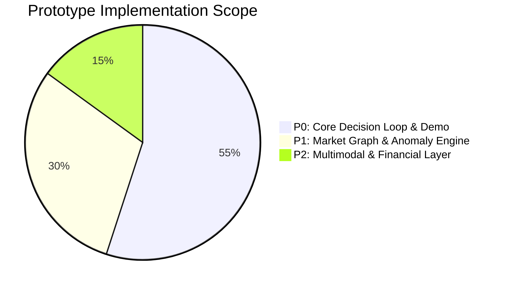
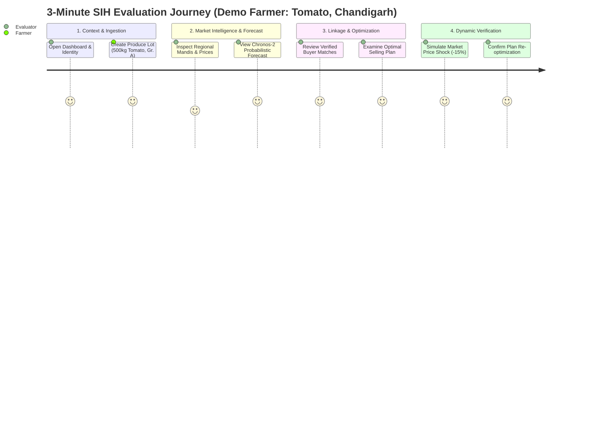

# AGRI-LINK AI: Product Requirements Document (PRD)

> **Project Identity**: AGRI-LINK AI  
> **SIH Problem Statement**: SIH26132 — Strengthening Market Linkages and Price Discovery for Farmers  
> **Target Engineering Quality**: Institutional depth, modularity, and operational polish modeled after [darkinspect](https://github.com/Shubhisingh16/darkinspect)

---

## 1. Executive Summary & Problem Background

In India's fragmented agricultural marketing landscape, smallholder farmers and Farmer Producer Organisations (FPOs) face severe structural information asymmetries. Current public platforms (such as Agmarknet portals) and private agritech applications suffer from three fatal product shortcomings:
1. **Rearview Mirror Portals**: They merely display historical or yesterday's APMC modal rates, which cannot help a farmer deciding what to harvest and sell today.
2. **Uncontextualized Scalar Forecasts**: Existing research prototypes generate isolated scalar price predictions (e.g., *"₹32/kg next Tuesday"*) without confidence bounds, risk quantification, or cost factoring.
3. **Headline Price Fallacy**: Farmers are directed toward distant markets advertising high headline prices, completely ignoring haulage freight, loading/unloading fees, APMC mandi taxes, quality assay rejections, and transit spoilage—often turning a theoretical profit into a realized financial loss.

### The AGRI-LINK Paradigm Shift
**AGRI-LINK AI** is not a static price bulletin board or a naive commodity marketplace. It is an **AI-driven decision-support and market linkage optimization engine**. 

The platform synthesizes:
$$\text{Market Intelligence} + \text{Probabilistic Forecasting} + \text{Buyer Matching} + \text{Logistics Engine} + \text{Storage Decay} + \text{Risk Valuation}$$

To answer the farmer's ultimate commercial question:
> **"Given my crop, quantity, quality, location, storage capacity, liquidity requirement and risk preference, what is the optimal way to sell my produce?"**

The primary deliverable generated for the farmer is not a raw chart; it is an actionable, risk-hedged **Optimal Selling Plan** (e.g., *Sell 60% immediately to verified Buyer X at ₹28.50/kg; hold 40% in village ventilated storage for 12 days to supply Terminal Mandi Y at an expected net price of ₹34.20/kg*).

---

## 2. Target User Personas

```
+------------------------------------------------------------------------------------------------------------------------+
|                                                   USER PERSONAS                                                        |
+========================================================================================================================+
| 1. Ramesh Kumar — Smallholder Farmer                                                                                  |
|    - Landholding: 2.5 acres in Mohali / Ropar, Punjab.                                                                 |
|    - Harvest: 500 kg table tomatoes (Grade A/B).                                                                       |
|    - Constraints: Zero refrigerated cold storage; high liquidity urgency (needs immediate cash for fertilizer);       |
|      lacks dedicated transport (relies on hired pick-up or village aggregator).                                         |
|    - Pain Point: Sells at distress prices (₹12/kg) to local village intermediaries while nearby Chandigarh trades at   |
|      ₹24/kg, because he cannot calculate net transport and price risk.                                                  |
+------------------------------------------------------------------------------------------------------------------------+
| 2. Balwinder Singh — Commercial Horticulturalist                                                                       |
|    - Landholding: 18 acres in Patiala, Punjab.                                                                         |
|    - Harvest: 12 tonnes of seed potato / table onion.                                                                  |
|    - Capabilities: Has access to shared cold storage (up to 30 days); balanced risk preference; negotiable transport. |
|    - Pain Point: Unable to time market peaks across interstate terminal markets (Delhi Azadpur vs. Ludhiana vs. Jaipur)|
|      and struggles to model weight loss/spoilage vs. storage rental costs over time.                                   |
+------------------------------------------------------------------------------------------------------------------------+
| 3. GreenHarvest FPO — Cooperative / FPO Manager (Gurpreet Kaur)                                                         |
|    - Scope: Represents 280 marginal vegetable growers across 12 villages.                                              |
|    - Aggregation: Aggregates 15–25 tonnes of produce weekly.                                                          |
|    - Capabilities: Can hire multi-axle trucks; negotiates directly with institutional buyers (retail supermarket       |
|      chains, food processors); can arrange e-NWR pledge financing.                                                     |
|    - Pain Point: Needs to allocate aggregated farmer lots between immediate cash-out buyers and forward contracts     |
|      while maintaining equitable payout realization and transparent audit logs for cooperative members.               |
+------------------------------------------------------------------------------------------------------------------------+
| 4. FreshBazaar Wholesale & Processing — Institutional Buyer (Vikram Malhotra)                                          |
|    - Profile: Regional procurement head for an organized quick-commerce and food processing company.                 |
|    - Requirements: Consistent daily delivery of 2–5 tonnes Grade A Tomato & Potato; stringent quality assays.          |
|    - Pain Point: Fragmented sourcing from unverified middlemen with high dispute rates, unreliable transit times,     |
|      and zero advance visibility into harvest readiness.                                                               |
+------------------------------------------------------------------------------------------------------------------------+
```

---

## 3. Product Architecture & Priority Matrix

Features are structured across three strict engineering phases: **P0 (Mandatory Hackathon Prototype)**, **P1 (Advanced Market Intelligence)**, and **P2 (Ecosystem Expansion)**.



### 3.1 P0: Core Platform & SIH Demo Requirements (Mandatory)

| ID | Module Name | Functional Specification |
| :--- | :--- | :--- |
| **P0-1** | **Farmer Dashboard & Identity** | Lightweight, high-contrast dashboard displaying active lots, prevailing regional market sentiment, quick lot creator, and recent selling plans. Supports bilingual toggle (English / Hindi). |
| **P0-2** | **Produce Lot Creation Wizard** | Multi-step form capturing: Crop (Tomato, Potato, Onion), Quantity (kg/quintals), Harvest Date, Quality Grade (Grade A, B, C), Location (PIN/district), Storage Availability (days & type: Ambient Shed vs. Cold Storage), Liquidity Preference (Immediate, Balanced, Can Wait), and Risk Preference (Conservative, Balanced, Aggressive). |
| **P0-3** | **Market Data & Price History** | Historical time-series price and arrival volume explorer for surrounding APMC mandis over 1M, 6M, 1Y, and 3Y horizons with agricultural year normalization. |
| **P0-4** | **Chronos-2 Probabilistic Forecasting** | 14-day and 30-day ahead probabilistic forecasting engine outputting median (P50) and confidence intervals (P10 downside, P90 upside). Evaluated against Naive and Seasonal baselines. |
| **P0-5** | **Multi-Market Comparison** | Spatial comparison table evaluating 3–5 accessible regional and terminal mandis, showing headline price vs. estimated transport cost vs. distance. |
| **P0-6** | **Transparent Buyer Discovery** | Directory of verified institutional and local buyers with active procurement bids, payment terms, and transparent match explanations (*Why Buyer X?*). |
| **P0-7** | **Net Realizable Value (NRV) Engine** | Core financial calculator deducting freight, storage rent, spoilage degradation, and APMC market fees from gross projected revenue. |
| **P0-8** | **Optimal Selling Plan Solver** | Optimization module evaluating 5 discrete split strategies (100% now, 100% hold, 25/75, 50/50, 75/25) across available channels (Buyer vs. Mandi), selecting the strategy maximizing risk-adjusted NRV. |
| **P0-9** | **Interactive What-If Simulator** | Dynamic client lab enabling real-time backend recalculation when the user tweaks sliders for transport cost, storage duration, market price shifts ($\pm 20\%$), or spoilage rates. |
| **P0-10** | **Self-Contained Demo Mode** | Zero-dependency offline demo mode with pre-seeded, verified benchmark datasets for the Chandigarh agricultural cluster, guaranteeing a 100% reliable 3-minute jury presentation. |

---

### 3.2 P1: Advanced Market Intelligence & Cooperative Features

| ID | Module Name | Functional Specification |
| :--- | :--- | :--- |
| **P1-1** | **Directed Lead-Lag Market Graph** | Directed graph representation where nodes represent mandis and weighted edges represent lead-lag price transmission delays ($k \in [-10, +10]$ days) calculated via rolling cross-correlation, identifying anchor vs. feeder markets. |
| **P1-2** | **Multi-Horizon Anomaly Detection** | Robust statistical anomaly engine utilizing Median Absolute Deviation (MAD) across peer mandis (`SAMEMONTH`), prior month (`LASTMONTH`), and prior harvest year (`LASTYEAR`), flagging price gouging or flash supply collapses. |
| **P1-3** | **Crop Perishability & Spoilage Curves** | Non-linear decay curves ($Q(t) = Q_0 e^{-\delta t}$) for Tomato, Onion, and Potato as a function of temperature, ambient humidity, and storage technology. |
| **P1-4** | **Logistics & Haulage Engine** | Distance matrix calculations, vehicle capacity matching (Pick-up 1T vs. Mini-truck 3T), fuel rate indexation, and loading/unloading fee estimation. |
| **P1-5** | **FPO Bulk Aggregation Portal** | Specialized cooperative console enabling FPO managers to aggregate individual member lots into bulk consignments, optimize multi-mandi dispatch, and generate member settlement sheets. |
| **P1-6** | **Data Quality & Freshness Sentinel** | Real-time telemetry dashboard monitoring data freshness, missing reporting days, interpolation confidence, and data source provenance. |

---

### 3.3 P2: Multimodal Intelligence & Ecosystem Expansion (Post-Demo Roadmap)

| ID | Module Name | Functional Specification |
| :--- | :--- | :--- |
| **P2-1** | **Multimodal Market Intelligence Agent** | Multimodal LLM integration (Gemini) ingesting regional news, agricultural advisories, and weather bulletins to provide structured, cited market explanations (strictly barred from generating numeric prices). |
| **P2-2** | **Weather & Climate Shock Triangulation** | Satellite and gridded IMD rainfall anomaly integration linking upstream rainfall events to downstream harvest delays and transport washouts. |
| **P2-3** | **Warehouse Receipt (e-NWR) Pledge Financing** | Automated loan calculator evaluating if depositing produce in a WDRA-accredited warehouse to take an immediate 70% pledge loan at 8% p.a. beats immediate distress liquidation. |
| **P2-4** | **Digital Buyer Intent & Counter-Offer Chat** | Secure, structured negotiation protocol allowing FPOs and verified buyers to confirm pickup time slots, binding escrow deposits, and quality acceptance certificates. |

---

## 4. Mathematical Formulations & Optimization Engine

### 4.1 Net Realizable Value (NRV)
The fundamental financial objective function of AGRI-LINK AI is to maximize the farmer's estimated net realization, **never** the gross headline price:

$$\text{NRV}(c, m, t) = \text{Gross Revenue} - \text{Logistics Cost} - \text{Storage Cost} - \text{Spoilage Loss} - \text{Market Fees} - \text{Risk Penalty}$$

Expanded mathematically:
$$\text{NRV}(q_0, c, m, t) = \underbrace{q_{\text{usable}}(t) \cdot \hat{P}_{c, m}(t, \text{grade})}_{\text{Realized Revenue}} - \underbrace{\left[ F_{\text{base}} + (D_m \cdot R_{\text{km}}) + q_0 \cdot C_{\text{handling}} \right]}_{\text{Logistics Cost}}$$
$$- \underbrace{\left[ q_0 \cdot t \cdot S_{\text{rate}}(\text{storage\_type}) \right]}_{\text{Storage Rental}} - \underbrace{\left[ (q_0 - q_{\text{usable}}(t)) \cdot P_{\text{salvage}} \right]}_{\text{Spoilage Loss}} - \underbrace{\left[ \mu_{\text{APMC}} \cdot \text{Gross Revenue} \right]}_{\text{APMC Mandi Tax / Cess}} - \Omega_{\text{risk}}$$

Where:
- $q_0$: Initial harvested quantity (kg).
- $q_{\text{usable}}(t)$: Surviving marketable quantity after $t$ days of storage.
- $\hat{P}_{c, m}(t, \text{grade})$: Expected price for crop $c$, grade $g$ at market $m$ on day $t$.
- $D_m$: Road distance from farm gate to market $m$ (km).
- $R_{\text{km}}$: Vehicle freight rate per km for selected haulage class.
- $S_{\text{rate}}$: Storage cost per kg per day (₹0 for on-farm ambient shed; ₹0.15–₹0.35/kg/day for commercial cold storage).
- $\mu_{\text{APMC}}$: Statutory market committee fee (typically 1.0% to 2.5% in major states).
- $\Omega_{\text{risk}}$: Risk discount penalty derived from forecast variance and farmer risk preference.

---

### 4.2 Crop Perishability & Spoilage Degradation Model

For the initial prototype, AGRI-LINK supports crop-specific physical weight and quality decay curves:

$$q_{\text{usable}}(t) = q_0 \cdot \exp\left( -\delta_{\text{decay}}(\text{crop}, \text{storage}) \cdot t \right)$$

#### Empirical Prototype Spoilage Rates ($\delta$ in days$^{-1}$)
| Crop | Storage Type: On-Farm Ambient Shed | Storage Type: Commercial Cold Storage | Max Feasible Holding Time |
| :--- | :--- | :--- | :--- |
| **Tomato (Perishable)** | $\delta = 0.045$ (~4.5% loss/day, max 5 days) | $\delta = 0.008$ (~0.8% loss/day, max 21 days) | Ambient: 5 days; Cold: 21 days |
| **Onion (Semi-Perishable)** | $\delta = 0.008$ (~0.8% loss/day, moisture shrinkage) | $\delta = 0.002$ (~0.2% loss/day, ventilated) | Ambient: 60 days; Cold: 180 days |
| **Potato (Storable)** | $\delta = 0.004$ (~0.4% loss/day, sprouting risk) | $\delta = 0.0008$ (~0.08% loss/day, climate control)| Ambient: 30 days; Cold: 240 days |

*Quality Grade Downgrade*: In addition to physical mass loss, perishable produce held under ambient conditions drops one quality grade (Grade A $\rightarrow$ Grade B) after $T_{\text{downgrade}}$ days (e.g., 3 days for summer tomatoes), reducing $\hat{P}$ by an assay penalty factor $\kappa_{\text{grade}} \approx 15\%$.

---

### 4.3 Behavioral Risk Preference & Prospect Theory Valuation

To ensure recommendations adapt to marginal farmers versus commercial growers, the objective function incorporates Kahneman-Tversky Prospect Theory:

$$\text{Utility}(\Delta \text{NRV}) = \begin{cases} (\Delta \text{NRV})^\alpha & \text{if } \Delta \text{NRV} \ge 0 \\ -\lambda (-\Delta \text{NRV})^\beta & \text{if } \Delta \text{NRV} < 0 \end{cases}$$

Where $\Delta \text{NRV} = \text{NRV}(t) - \text{NRV}(t_0)$ represents the net incremental gain or loss of holding produce relative to immediate liquidation today ($t_0$).
- **Conservative Profile**: $\lambda = 2.50$, $\alpha = 0.75$. Severe loss aversion; heavily penalizes forecast uncertainty and downside price volatility.
- **Balanced Profile**: $\lambda = 1.75$, $\alpha = 0.88$. Standard empirical risk-return trade-off.
- **Aggressive Profile**: $\lambda = 1.05$, $\alpha = 0.98$. Near risk-neutral; seeks maximum expected upside potential regardless of variance.

---

### 4.4 Transparent Buyer Matching Engine
AGRI-LINK scores candidate buyers using a transparent, multi-criteria additive index—**never an opaque black-box score**:

$$\text{Buyer Match Score} = w_1 \cdot \text{NetRealizationBonus} + w_2 \cdot \text{ReliabilityScore} + w_3 \cdot \text{SpeedScore} + w_4 \cdot \text{QualityFit}$$

#### Transparent Match Breakdown Schema
Every buyer card in the UI displays an explicit decomposition:
- `+₹1.80/kg`: Premium over local APMC mandi modal price after transport deduction.
- `+98%`: Historical settlement and payment reliability score (low cancellation history).
- `+24h`: Rapid farmgate pickup window (buyer provides own transport).
- `Grade A Exact Match`: Buyer demands high-grade table fruit, preventing quality rejection risk.
- `-₹0.40/kg`: Slight payment delay penalty (Net-3 days settlement vs. immediate mandi cash).

---

### 4.5 Optimal Selling Plan (Discrete Strategy Optimization)
The solver evaluates candidate distribution vectors $\mathbf{s} = (s_{\text{now}}, s_{\text{hold}})$ over candidate channels:
1. **Strategy 1 (100% Sell Now)**: Immediate liquidation at farm gate or local APMC mandi.
2. **Strategy 2 (100% Hold)**: Stored holding targeting the optimal forecast peak within the crop's maximum storage lifespan.
3. **Strategy 3 (25% Now / 75% Hold)**: Moderate liquidity release with heavy upside retention.
4. **Strategy 4 (50% Now / 50% Hold)**: Balanced hedging strategy.
5. **Strategy 5 (75% Now / 25% Hold)**: High immediate cash-out with conservative speculative upside.

The solver computes $\mathbb{E}[\text{NRV}]$ and 10th percentile Value-at-Risk ($\text{VaR}_{10}$) for each strategy, selecting the configuration that maximizes expected utility under the farmer's liquidity and risk constraints.

---

## 5. End-to-End User Experience & 3-Minute SIH Demo Flow

To ensure an impactful, flawlessly executed 3-minute hackathon evaluation, AGRI-LINK includes a designated, end-to-end demo scenario pre-seeded in the application:



### Scripted 3-Minute Presentation Walkthrough

#### Step 1: Dashboard & Lot Creation (0:00 – 0:45)
- **Action**: The evaluator lands on `/dashboard`. Clicks **"+ Create Produce Lot"**.
- **Input Selection**:
  - *Farmer Name*: Ramesh Kumar (Chandigarh Cluster)
  - *Commodity*: **Tomato** (Hybrid Table Quality)
  - *Quantity*: **500 kg** (20 crates)
  - *Grade*: **Grade A** (Firm, Red, Uniform Size)
  - *Storage Available*: **3 Days Ambient Farm Shed**
  - *Liquidity Need*: **Balanced** (Requires ₹5,000 within 48 hours)
  - *Risk Preference*: **Balanced**
- **Outcome**: The system registers Lot `#LOT-2026-T88` and automatically triggers the analytical pipeline.

#### Step 2: Market Intelligence & Chronos-2 Forecasting (0:45 – 1:30)
- **Action**: Navigates to the Market Intelligence tab.
- **Visualization**:
  - Displays surrounding APMC markets: **Chandigarh Mandi (Sector 26)** (8 km, ₹22.00/kg), **Panchkula Mandi** (14 km, ₹23.50/kg), **Kalka Mandi** (28 km, ₹26.00/kg).
  - Chronos-2 forecast curve renders over the next 14 days with shaded P10–P90 quantile uncertainty bands. 
  - **Key Insight**: The model predicts an acute supply tightening in 4 days due to heavy unseasonal rains in Himachal Pradesh feeder belts, pushing median wholesale prices up from ₹22.00 to ₹31.00/kg (+$9.00/kg upside).

#### Step 3: Buyer Discovery & Net Realization Analysis (1:30 – 2:15)
- **Action**: Clicks into the Buyer Discovery tab.
- **Candidate Matches**:
  - *Buyer 1 (FreshBazaar Retail Chain)*: Offers ₹25.50/kg, farmgate pickup in 24h, payment in 24h, 98% reliability.
  - *Buyer 2 (Himalayan Puree Co.)*: Offers ₹21.00/kg, bulk delivery, payment immediate, accepts Grade B.
  - *Buyer 3 (Local Commission Agent)*: Offers ₹19.00/kg immediate cash at yard.
- **Transparent Breakdown**: FreshBazaar yields an instant net realization bonus of +₹3.50/kg over local mandi after saving transport haulage fees.

#### Step 4: The Optimal Selling Plan (2:15 – 2:40)
- **Action**: System generates the **Optimal Selling Plan**:
  ```
  ╔═══════════════════════════════════════════════════════════════════════╗
  ║                      RECOMMENDED SELLING PLAN                         ║
  ║  Strategy: SPLIT SALE — 50% SELL NOW / 50% HOLD (2 DAYS)            ║
  ║  Estimated Net Realization: ₹13,425 (vs. ₹9,200 local immediate sale)║
  ║  Net Value Added: +₹4,225 (+45.9% Farmer Income Gain)                ║
  ╚═══════════════════════════════════════════════════════════════════════╝
  ```
- **Rationale**:
  - *Tranche 1 (250 kg)*: Dispatched immediately to **FreshBazaar** at ₹25.50/kg $\rightarrow$ Unlocks ₹6,375 instant cash, satisfying the farmer's ₹5,000 urgent liquidity need.
  - *Tranche 2 (250 kg)*: Held in farm shed for 48 hours; dispatched on Day 3 morning to **Kalka Mandi** at anticipated peak of ₹29.50/kg before decay threshold ($< 2\%$ weight loss).

#### Step 5: What-If Sensitivity Simulator & Final Decision (2:40 – 3:00)
- **Action**: Evaluator tests resilience by dragging the **"Market Price Shift"** slider to **-15%** (simulating unexpected surplus arrivals).
- **Dynamic Re-optimization**: The backend instantaneously recalculates the optimization surface:
  - Holding produce now yields negative expected utility due to price depreciation and spoilage risk.
  - Plan automatically updates to: **SELL 100% IMMEDIATELY to FreshBazaar**, locking in ₹12,750 net revenue and protecting the farmer against a ₹3,000 market collapse.
- **Conclusion**: Demonstrates live, mathematically sound, explainable agricultural decision intelligence.

---

## 6. Data Intelligence, Freshness & Provenance Contracts

To uphold institutional integrity, AGRI-LINK enforces strict data governance:

1. **Explicit Data Freshness Metadata**:
   Every response payload and UI card displaying market data includes standardized metadata:
   ```json
   {
     "mandi_id": "MND_CHANDIGARH_01",
     "commodity": "Tomato",
     "modal_price": 2200.0,
     "arrival_tonnes": 48.5,
     "data_timestamp": "2026-09-15T08:30:00Z",
     "data_freshness_status": "FRESH",
     "source": "Agmarknet Daily Feed (DMI)",
     "is_demo_data": false,
     "confidence_score": 0.94
   }
   ```
2. **Missing Data & Imputation Disclosure**:
   If a market has missing trade dates, the system marks the interpolated records clearly:
   `interpolation_method: "Stineman_Monotone_PCHIP"`, `imputed_points_count: 2`.
3. **No Fake Telemetry**:
   The application never displays randomized "blinking green live tickers" to mimic simulated real-time data. Live data is timestamped; demo benchmark data is labeled with a visible badge.

---

## 7. Non-Functional Requirements & Engineering Standards

| Dimension | Target Specification | Enforcement Mechanism |
| :--- | :--- | :--- |
| **API Response Latency** | $\le 150$ ms for cached market queries; $\le 450$ ms for full multi-market NRV optimization. | Redis hot caching of market graphs and pre-computed forecast vectors; vectorized NumPy optimization. |
| **Mobile Responsiveness** | Flawless rendering on mobile screens ($360\text{px} - 430\text{px}$) and low-end Android devices. | Tailwind mobile-first design, lightweight SVG charts, touch-friendly slider controls. |
| **Offline Resilience** | Application UI remains fully navigable without active internet; cached plans and demo data load offline. | Service Worker caching, Next.js PWA manifest, local IndexedDB state persistence. |
| **Localization & Accessibility** | Full dual-language support (English and Hindi); high-contrast UI meeting WCAG 2.1 AA standards for outdoor sunlight readability. | Next-intl localization framework; semantic color tokens for price trends (emerald green, amber, crimson). |
| **Security & Privacy** | Farmer personal details and exact farm coordinates are never exposed to unverified buyers. | Field-level masking, JWT authentication with role-based access control (Farmer, FPO, Buyer, Admin). |

---

## 8. Edge Cases, Failure Modes & User Safeguards

1. **Extreme Volatility / Flash Crashes**:
   - *Condition*: Daily market modal price drops by $> 30\%$ overnight (e.g. sudden onion export duty imposition).
   - *Safeguard*: Anomaly engine triggers an **"Emergency Market Alert"**; freezes speculative holding recommendations; advises immediate liquidation or e-NWR warehouse pledge financing.
2. **Infeasible Storage Request**:
   - *Condition*: Farmer attempts to hold tomatoes for 14 days in an ambient shed.
   - *Safeguard*: System rejects the strategy as physically infeasible ($> 60\%$ projected spoilage); prompts user to either book commercial cold storage or sell immediately.
3. **Zero Local Buyer Matches**:
   - *Condition*: Remote rural farm has zero registered institutional buyers within a 50 km radius.
   - *Safeguard*: Fallback solver defaults to multi-mandi APMC logistics routing, identifying the optimal regional APMC market maximizing net returns after haulage.

---
*End of PRODUCT_SPEC.md. Approved for architectural implementation and testing.*
