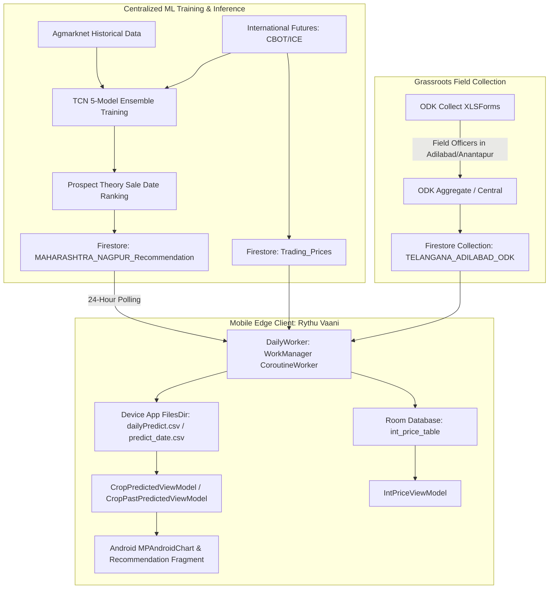
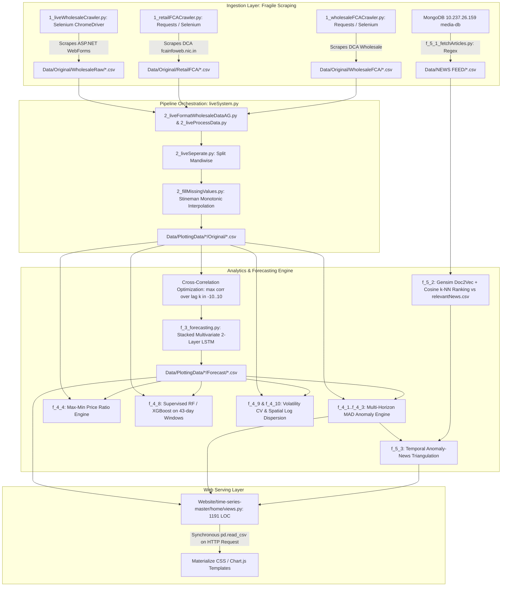

# AGRI-LINK AI: Research Repository Analysis & Architectural Blueprint

> **Problem Statement**: SIH26132 — Strengthening Market Linkages and Price Discovery for Farmers.  
> **Core Strategic Question**: *"Given my crop, quantity, quality, location, storage capacity, liquidity needs and risk preference, what is the optimal way to sell my produce?"*  
> **Engineering Benchmark**: Grounded in the architectural depth, modularity, and operational rigor demonstrated in [darkinspect](https://github.com/Shubhisingh16/darkinspect).

---

## Executive Summary

This document presents a comprehensive, empirical code and architecture audit of two primary academic research repositories:
1. **`references/farmers_collective`** (*Rythu Vaani / CoRE Stack / CCD / ACT4D IIT Delhi / Google AI for Social Good*, published at ACM COMPASS 2023, DOI: [10.1145/3609262](https://dl.acm.org/doi/10.1145/3609262)).
2. **`references/commodity_analysis`** (*Price Forecasting and Anomaly Detection for Agricultural Commodities in India*, ICTD Lab, Department of Computer Science & Engineering, IIT Delhi).

Both repositories solve adjacent sub-problems of agricultural market intelligence in India. However, both exhibit substantial architectural debt, legacy dependencies, unhandled merge conflicts, fragile scraping pipelines, and incomplete decision support loops. 

This analysis extracts their salvageable mathematical algorithms, data schemas, and domain insights while establishing a clean-room architectural foundation for **AGRI-LINK AI**—upgrading from legacy heuristics to an enterprise-grade, probabilistic market intelligence and multimodal decision-optimization platform.

---

## 1. Repository Overview

| Dimension | `references/farmers_collective` | `references/commodity_analysis` |
| :--- | :--- | :--- |
| **Origin & Provenance** | ACT4D (IIT Delhi), Gram Vaani, Centre for Collective Development (CCD), Google AI for Social Good. ACM COMPASS 2023. | ICTD Lab, Department of Computer Science & Engineering, IIT Delhi. MSR Thesis / Academic Research Project. |
| **Target Audience** | Smallholder farmers and cooperative field officers in rural Telangana (Adilabad) and Andhra Pradesh (Anantapur). | Macro market surveillance analysts, policy researchers, and government monitoring bodies. |
| **Primary Scope** | Non-perishable kharif cash crops (principally **Soybean**, secondary **Cotton** and **Red Gram**). Micro-level farmgate trader vs. mandi comparison. | 7 essential food commodities: **Onion**, **Potato**, **Tomato** (perishables/TOP) + **Rice**, **Moong Dal**, **Masur Dal**, **Mustard Oil**. |
| **Frontend Delivery** | Android Native Client (*Rythu Vaani*, Kotlin 1.8, Jetpack Architecture Components, MPAndroidChart). | Web Portal (Django 3.0.4, jQuery, Materialize CSS, Chart.js / SVG). |
| **Backend & Storage** | Google Firebase (Firestore documents) + Local SQLite / Room DB + CSV sync caching via Android `DailyWorker`. | Monolithic procedural Python 3.6 scripts, SQLite3 (`db.sqlite3`), and filesystem CSV directories (`Data/PlottingData`). |
| **Inference Mode** | Offline batch prediction uploaded to Firestore; mobile app synchronizes static prediction vectors via 24h WorkManager. | Scheduled batch execution orchestrated via `liveSystem.py` writing static forecast CSVs to disk. |
| **Core Value Prop** | "When should I sell?" Top-3 recommended sale dates ranked by expected net gain and Prospect Theory risk weighting. | "Is this price normal or manipulated?" 30-day multivariate price/arrival forecasting, multi-horizon anomaly detection, and news event linking. |

---

## 2. Architectural Comparison & Analysis

### 2.1 System Architectures

#### `farmers_collective` Architecture


#### `commodity_analysis` Architecture


### 2.2 Architectural Critique & Failure Modes

1. **Storage Decoupling vs. Monolithic File Couplings**:
   - `farmers_collective` stores daily predictions as serialized string fields inside Firestore documents (`doc.data["data"]`), which the Android client parses by writing raw CSV strings to `context.filesDir`. While offline-tolerant, it lacks relational integrity, schema migrations, and atomic transactions.
   - `commodity_analysis` has **zero database abstraction** for time series. Every Django view handler in `Website/time-series-master/home/views.py` invokes `pd.read_csv("../../Data/PlottingData/...")` directly inside the HTTP request loop. Under 10 concurrent requests, this locks filesystem IO and crashes the Gunicorn worker process.
2. **Scraping Brittleness**:
   - `commodity_analysis` relies on a compiled 64-bit Linux binary `chromedriver` (version 86) checked into Git. It clicks through ASP.NET dropdowns with `driver.implicitly_wait(600)` (a 10-minute timeout!). Any minor change in the government portal's ASP.NET ViewState (`__VIEWSTATE`, `__EVENTVALIDATION`) causes catastrophic script failure.
3. **Pipeline Failure Propagation**:
   - `liveSystem.py` runs sequentially as a single monolithic script. If step 1 (Agmarknet crawler) encounters a network hiccup or CAPTCHA, steps 2 through 5 (cleaning, forecasting, anomaly detection, news tagging) never execute. There is no DAG orchestration, checkpointing, or idempotency.

---

## 3. Data Sources & Schema Specifications

### 3.1 Primary External Data Sources

1. **Agmarknet (Directorate of Marketing & Inspection, MoA&FW)**:
   - *Interface*: ASP.NET WebForms scraper (`DatewiseCommodityReport.aspx`).
   - *Frequency*: Daily reported wholesale arrivals and mandi trade rates.
   - *Granularity*: State $\rightarrow$ District $\rightarrow$ APMC Market (Mandi) $\rightarrow$ Commodity $\rightarrow$ Variety $\rightarrow$ Grade.
2. **Department of Consumer Affairs (Price Monitoring Division - DCA/FCA)**:
   - *Interface*: Web portal scraper (`fcainfoweb.nic.in/reports/report_menu_web.aspx`).
   - *Frequency*: Daily wholesale and retail price dissemination across ~100 designated urban monitoring centres.
3. **Centre for Collective Development (CCD) Grassroots ODK Feeds**:
   - *Interface*: Mobile ODK Aggregate/Central forms uploaded by village field animators.
   - *Frequency*: Bi-weekly to daily village-level trader transactions in Adilabad and Anantapur.
4. **International Commodities Futures (CBOT / ICE via Financial Feeds)**:
   - *Interface*: Synced via Firebase `Trading_Prices` collection.
   - *Commodities*: Chicago Board of Trade (CBOT) Soybean futures; Intercontinental Exchange (ICE) Cotton futures.
5. **Media Database (IIT Delhi Internal News Archive)**:
   - *Interface*: MongoDB instance (`mongodb://10.237.26.159:27017`), collection `media-db.articles`.
   - *Scope*: Scraped English print media (The Hindu, Times of India, Indian Express, Business Standard).

### 3.2 Concrete Data Schemas

#### A. Agmarknet Wholesale Raw Schema (`Data/Original/WholesaleRaw`)
```csv
State,District,Market,Commodity,Variety,Grade,Arrival_Date,Arrivals_Tonnes,Min_Price,Max_Price,Modal_Price
Telangana,Adilabad,Adilabad,Soyabean,Yellow,FAQ,12/10/2021,142.50,3850,4200,4100
```
*Units*: Arrivals in Metric Tonnes; Prices in INR per Quintal (100 kg).

#### B. Processed Cleaned Time-Series Schema (`Data/PlottingData/{COMMODITY}/Original`)
```csv
DATE,PRICE
2016-01-01,3100.00
2016-01-02,3105.42
...
```
*Note*: Processed via Stineman interpolation to form a contiguous 365-day time-series without weekend/holiday missing dates.

#### C. ODK Field Submission Schema (`TELANGANA_ADILABAD_ODK.csv`)
```csv
cropId,localTraderId,mandalId,marketId,personFillingId,price,date
1,3,Utnoor,1,FieldOfficer_04,3920,2021-10-15
```
*Identifiers*: `cropId`: 1=Soybean, 2=Red Gram, 3=Cotton; `localTraderId`: maps to named village intermediaries (e.g., PMRSS, Ankush-Utnoor, Kamdhenu Trader); `price`: Farmgate price offered in INR/Quintal.

#### D. Prediction Vector Schema (`predict_{YYYY-MM-DD}.csv` / `MAHARASHTRA_NAGPUR_Recommendation`)
```csv
DATE,CONFIDENCE,PREDICTED,MEAN_PRICE,MEAN_GAIN,MEAN_LOSS
2021-11-05,0.78,4450.00,4410.50,180.00,-45.00
```
- `CONFIDENCE`: Empirical probability $\in [0, 1]$ that the market price on `DATE` will exceed the price on the recommendation baseline date.
- `PREDICTED`: Point forecast value.
- `MEAN_PRICE`: Expected value across ensemble distribution.
- `MEAN_GAIN` / `MEAN_LOSS`: Conditional expectations of upward gain vs. downward drawdown relative to harvest day.

#### E. Anomaly Benchmark & Indicator Schema (`Combined/Price.csv` & `KforMADs.csv`)
```csv
STARTDATE,ENDDATE,LASTMONTH,LASTYEAR,SAMEMONTH,MAXMINRATIO,STATENAME,MANDINAME,COMMODITY
2020-09-01,2020-10-14,Normal,Anomaly,Anomaly,1.48,MAHARASHTRA,NAGPUR,ONION
```

---

## 4. Critical Files Inventory

### 4.1 `references/farmers_collective`

| File Path | LOC | Core Responsibility & Architectural Value |
| :--- | :--- | :--- |
| `android app/app/src/main/java/.../workers/DailyWorker.kt` | 443 | Background sync orchestrator. Polls Firestore collections for Mandi prices, 2-year prediction histories, and international CBOT prices. Serializes JSON responses into local device CSVs. |
| `android app/app/src/main/java/.../prediction/CropPredictedViewModel.kt` | 187 | Recommender logic. Loads `dailyPredict.csv`, sorts target dates by prospect output utility, filters top 3 recommendation horizons, and computes relative gain/loss metrics against current day baseline. |
| `android app/app/src/main/java/.../prediction/CropPastPredictedViewModel.kt` | 180 | Model audit & transparency engine. Compares historical recommendations against actual realized prices and calculates the theoretical "Oracle Best" date to evaluate model regret. |
| `android app/app/src/main/java/.../data/Prediction.kt` | 23 | Core data class defining probabilistic forecast output: date, confidence, point prediction, mean price, expected gain, expected loss. |
| `android app/app/src/main/java/.../realtime/CropPricesViewModel.kt` | 430 | Multi-year and multi-mandi comparative visualization engine. Handles agricultural year alignment (July 1 to June 30) and normalizes calendar dates for seasonal overlay. |
| `android app/app/src/main/java/.../utils/Utils.kt` | 220 | Constants, MSP lookups (2015–2023), local trader dictionary, and custom MPAndroidChart gesture listener bindings. |

### 4.2 `references/commodity_analysis`

| File Path | LOC | Core Responsibility & Architectural Value |
| :--- | :--- | :--- |
| `Code/liveSystem.py` | 206 | Master pipeline runner. Orchestrates end-to-end flow from crawling through forecasting and news linking. Contains critical git merge conflicts. |
| `Code/stineman.py` | 160 | Python implementation of Russell Stineman's (1980) monotonic interpolation algorithm. Interpolates missing price days while strictly bounding local gradients. |
| `Code/f_1_liveWholesaleCrawler.py` | 120 | Selenium-based Agmarknet automated scraper targeting datewise commodity tables. |
| `Code/f_3_forecasting.py` | 233 | Stacked 2-layer Multivariate LSTM with lead-lag cross-correlation alignment to predict 30-day price trajectories. |
| `Code/f_4_1_checkPeriodsUsingSameMonth.py` | 224 | Spatial anomaly detection engine using Median Absolute Deviation (MAD) across peer mandis in a 43-day rolling window. |
| `Code/f_4_8_anomalyDetectionML.py` | 242 | Supervised anomaly classification using Random Forest, Gradient Boosting, and XGBoost on engineered price-spread and arrival-pressure features. |
| `Code/volatility.py` | 292 | Computes temporal price volatility normalized via Coefficient of Variation ($CV = \sigma / \mu$) across calendar months. |
| `Code/dispersion.py` | 229 | Calculates spatial market fragmentation across mandis using standard deviation of logarithmic prices ($\sigma_{\ln P} / \mu_{\ln P}$). |
| `Code/f_5_2_rankNewsArticles.py` | 307 | Vectorizes scraped news using Gensim Doc2Vec; ranks relevance via k-NN cosine distance against labeled ground truth (`relevantNews.csv`). |
| `Code/f_5_3_newsFeed.py` | 313 | Triangulates price anomalies with contextual news events across a 15-day lookback window; isolates unexplained anomalies. |
| `Website/time-series-master/home/views.py` | 1191 | Monolithic Django view controller serving landing pages, volatility charts, and anomaly inspection modals via synchronous CSV parsing. |

---

## 5. Mathematical Formulations & Useful Algorithms

### 5.1 Stineman Monotonic Interpolation (`Code/stineman.py`)
Agricultural time series feature extensive irregular missing periods (Sundays, national holidays, local APMC strikes). Traditional linear interpolation yields non-differentiable sharp corners, while cubic splines introduce severe oscillatory overshoots (predicting non-existent negative prices or unrealistic peaks).

Stineman interpolation constructs a curve passing through points $(x_i, y_i)$ with slopes $y'_i$ estimated from the circle or parabola passing through three consecutive points:
$$y'_i = \frac{s_{i-1} \Delta x_i + s_i \Delta x_{i-1}}{\Delta x_{i-1} + \Delta x_i}$$
where $s_i = \frac{y_{i+1} - y_i}{x_{i+1} - x_i}$. Between points, it uses a rational function that guarantees the interpolant remains strictly monotonic on any interval where the slopes $s_i$ and end-point derivatives have the same sign.

### 5.2 Lead-Lag Cross-Correlation Alignment (`Code/f_3_forecasting.py`)
Agricultural trade flows from high-volume terminal markets to feeder rural mandis with physical transit and information transmission delays. To leverage a primary market ($Y$) as an exogenous feature for a rural market ($X$), the optimal lag $k^*$ is computed over a search window $k \in [-10, +10]$ days:
$$r(k) = \frac{\sum_{t} (X_t - \bar{X})(Y_{t-k} - \bar{Y})}{\sqrt{\sum_{t}(X_t - \bar{X})^2 \sum_{t}(Y_{t-k} - \bar{Y})^2}}$$
$$k^* = \arg\max_{k \in [-10, 10]} r(k)$$
The exogenous series $Y$ is then shifted by $k^*$ before feeding into the sequence model.

### 5.3 Multi-Horizon Median Absolute Deviation (MAD) Anomaly Engine
Standard deviation is notoriously sensitive to extreme agricultural outliers (e.g. 300% onion price spikes). The system substitutes median and MAD:
$$\text{MAD} = \text{median}\left( | X_i - \text{median}(X) | \right)$$
An observation $P_t$ is flagged anomalous if:
$$| P_t - \text{median}(X) | > K \cdot \text{MAD}$$
where $K$ is tuned per commodity and temporal horizon (from `KforMADs.csv`):
- **Peer Mandi Horizon (`SAMEMONTH`)**: $K \in [1.4, 1.5]$. Captures isolated local price gouging when regional peer mandis remain stable.
- **Sequential Horizon (`LASTMONTH`)**: $K \in [1.2, 2.0]$. Captures abrupt inter-month supply shocks.
- **Seasonal Horizon (`LASTYEAR`)**: $K \in [1.6, 2.5]$. Evaluates price deviations against historical harvest cycles.

### 5.4 Spatial Market Integration (Dispersion Index)
Measures the breakdown of the Law of One Price across Indian states. In a frictionless unified market, spatial price differences equal transportation cost. When spatial dispersion spikes, it indicates interstate transport bottlenecks, hoarding, or localized export bans:
$$\text{Dispersion}_m = \frac{\sigma \left( \{ \ln \bar{P}_{i, m} \}_{i=1}^M \right)}{\mu \left( \{ \ln \bar{P}_{i, m} \}_{i=1}^M \right)}$$
where $\bar{P}_{i,m}$ is the monthly mean price in mandi $i$.

### 5.5 Prospect Theory Decision Formulation (`farmers_collective`)
Standard expected utility theory fails for smallholder farmers who face existential downside risk. Farmers are loss-averse: a ₹200 loss hurts significantly more than a ₹200 gain pleases.

The sale recommendation evaluates prospective sale dates $t$ relative to current harvest date $t_0$ (price $P_0$):
$$\Delta P_t = P_t - P_0$$
Value function $V(\Delta P_t)$ following Kahneman & Tversky (1979):
$$V(\Delta P_t) = \begin{cases} (\Delta P_t)^\alpha & \text{if } \Delta P_t \ge 0 \\ -\lambda (-\Delta P_t)^\beta & \text{if } \Delta P_t < 0 \end{cases}$$
where $\lambda > 1$ is the coefficient of loss aversion (empirically set to $\approx 2.25$), and $\alpha, \beta \approx 0.88$ represent diminishing sensitivity. Recommendations rank dates maximizing prospective net utility rather than raw expected price.

---

## 6. Curated & Useful Datasets

1. **`Data/Information/neighbouringMandiInformation.csv`**:
   - 115 curated pairwise mandi relationships across India with empirical Pearson correlation coefficients and transmission lead/lag days. 
   - *Example*: Potato in `WEST BENGAL_KALYANI` vs `WEST BENGAL_ULUBERIA` ($r = 0.9897$, Lag = $+2$ days); Rice in `UTTAR PRADESH_LUCKNOW` vs `PUNJAB_BATHINDA` ($r = 0.8217$, Lag = $+9$ days).
2. **`Data/Information/KforMADs.csv`**:
   - Calibrated statistical dispersion multipliers ($K$) across 7 commodities and 3 temporal horizons.
3. **`Data/Information/state_district_centre_mandi.csv`**:
   - Master entity-resolution crosswalk mapping Agmarknet rural APMC mandis to Ministry of Consumer Affairs urban retail price reporting centres.
4. **`Data/Information/relevantNews.csv`**:
   - Manually curated and labeled benchmark dataset of Indian agricultural news articles annotated for relevance to market anomalies.
5. **`references/farmers_collective/farmers collective/ODK Project/`**:
   - Production XLSForms (`Data Entry Form Adilabad.xlsx`, `Sales Cooperative.xlsx`) encoding real-world survey workflows, trader price capture, and mandi transaction schemas.

---

## 7. Reusable Concepts for AGRI-LINK

1. **Terminal-to-Feeder Mandi Surrogate Modeling**:
   - Small rural mandis have sparse, intermittent reporting. AGRI-LINK should adopt the surrogate paradigm: map data-sparse rural mandis to high-volume liquid reference mandis (e.g. Azadpur, Vashi, Lasalgaon) via cross-correlation lead-lag networks.
2. **Farmgate-to-Mandi Spread Transparency**:
   - Smallholders rarely sell at the APMC mandi directly; they sell at the farmgate to village intermediaries due to lack of transport. Tracking the local village trader spread ($\text{Price}_{APMC} - \text{Price}_{Farmgate}$) gives farmers vital bargaining leverage.
3. **Behavioral Risk Preferences in Crop Selling**:
   - An algorithm that recommends "hold crop for 45 days for an expected 8% price increase" is dangerous if the farmer has an immediate debt repayment deadline or lack of moisture-proof storage. Modeling decision recommendations using risk tolerance and liquidity urgency is essential.
4. **Triangulating Unexplained Anomalies**:
   - Classifying market conditions into:
     - *Explained Anomaly*: Price spike supported by verified news of unseasonal rainfall or export tariff change.
     - *Unexplained Anomaly*: Price spike or collapse without structural news, flagging potential cartelization, hoarding, or reporting error.
5. **Agricultural Year Normalization**:
   - Agricultural commodity cycles do not follow the Gregorian calendar ($Jan 1 - Dec 31$). Kharif crops follow a July 1 to June 30 crop year. Grouping seasonal overlays by agricultural year prevents cycle misalignment.

---

## 8. What We Must NOT Reuse (Anti-Patterns & Architectural Hazards)

```
+-------------------------------------------------------------------------------+
|                      HAZARDOUS CODE & DESIGN PATTERNS                         |
+===============================================================================+
| 1. Selenium ASP.NET Web Scraping (1_liveWholesaleCrawler.py)                 |
|    - 600s implicit waits; depends on binary Linux chromedriver                |
|    - Breaks on DOM/ViewState changes; high memory footprint                  |
+-------------------------------------------------------------------------------+
| 2. Synchronous CSV Disk IO in Web Handlers (views.py)                         |
|    - pd.read_csv() executed on every incoming HTTP GET request                |
|    - Unindexed, unbounded RAM consumption, unscalable beyond single user     |
+-------------------------------------------------------------------------------+
| 3. Hardcoded Internal Infrastructure & Unresolved Merge Conflicts            |
|    - Hardcoded IP: mongodb://10.237.26.159:27017 in f_5_1_fetchArticles.py     |
|    - Git merge conflicts left in production code (liveSystem.py: lines 16-26) |
+-------------------------------------------------------------------------------+
| 4. Deprecated Python & Machine Learning Syntax                                |
|    - np.float (removed in NumPy 1.24) -> crashes on modern runtimes           |
|    - DataFrame.append() (removed in Pandas 2.0) -> fatal runtime errors       |
|    - Series.mad() (removed in Pandas 2.0) -> breaks anomaly detection         |
|    - use_label_encoder=False in XGBoost (deprecated/removed)                  |
+-------------------------------------------------------------------------------+
| 5. Deterministic Point LSTM Forecasting                                       |
|    - Point forecasts (y_hat) without confidence intervals or error bounds    |
|    - Fails to capture non-Gaussian commodity tails and climate volatility     |
+-------------------------------------------------------------------------------+
| 6. Hardcoded District Scope                                                   |
|    - Switch statements hardcoding Adilabad or Nagpur directly in view models  |
+-------------------------------------------------------------------------------+
```

---

## 9. Licensing & Intellectual Property Considerations

### 9.1 Empirical Legal Status
A rigorous audit of both cloned repositories confirms:
- **`references/farmers_collective`**: **NO LICENSE FILE**. Contains copyright notices referencing ACT4D / IIT Delhi / CCD / Google AI4SG in research documentation.
- **`references/commodity_analysis`**: **NO LICENSE FILE**. The only licenses present are third-party vendor licenses in checked-in packages (jQuery, Select2, six, sqlparse).

### 9.2 Legal Implications
Under international copyright law (the Berne Convention and Indian Copyright Act, 1957), software repositories without an explicit license are **All Rights Reserved** by default. No open-source permissions (such as MIT, Apache 2.0, or BSD) are granted.

### 9.3 Clean-Room Engineering Mandate for AGRI-LINK
To protect the integrity of the AGRI-LINK AI platform and comply with institutional hackathon standards:
1. **Zero Code Copying**: Not a single function, file, or code block may be copied or vendored from either repository.
2. **Clean-Room Implementation**: All algorithms (Stineman interpolation, MAD anomaly detection, prospect theory valuation, spatial dispersion) must be written from scratch using first-principles mathematical definitions.
3. **Standard Open Government APIs**: Data ingestion must utilize official, documented public endpoints (such as Open Government Data Platform India, `data.gov.in`, or the official Agmarknet REST portal) rather than scraping internal university servers.

---

## 10. What AGRI-LINK AI Can Improve

```
+---------------------+---------------------------------+----------------------------------+
| Architectural Layer | Reference Implementations       | AGRI-LINK AI Specification       |
+=====================+=================================+==================================+
| Ingestion & ETL     | Selenium UI automation,         | Async HTTP client (httpx),       |
|                     | hardcoded ASP.NET scraping,     | data.gov.in REST APIs,           |
|                     | single-threaded execution       | Celery/Temporal DAGs with retry  |
+---------------------+---------------------------------+----------------------------------+
| Storage Engine      | Raw unindexed CSV directories,  | TimescaleDB (PostgreSQL) for     |
|                     | flat files in app storage       | time-series; Redis cache layer   |
+---------------------+---------------------------------+----------------------------------+
| Forecasting Engine  | 2-layer stacked LSTM            | Probabilistic Temporal Fusion    |
|                     | producing deterministic scalar  | Transformer (TFT) / NeuralProphet|
|                     | point predictions               | with conformal prediction bands  |
+---------------------+---------------------------------+----------------------------------+
| Anomaly Detection   | Standalone scripts, uncalibrated| Real-time streaming anomaly      |
|                     | batch classification            | detector fusing price, arrival,  |
|                     |                                 | weather, and transport indices   |
+---------------------+---------------------------------+----------------------------------+
| Market Intelligence | Gensim Doc2Vec keyword matching | Gemini Multimodal LLM Agent with |
|                     | against closed academic MongoDB | live news grounding & citations  |
+---------------------+---------------------------------+----------------------------------+
| Decision Engine     | Static Top-3 sale dates based   | Constrained Multi-Objective      |
|                     | on price alone                  | Optimization (Net Realizable     |
|                     |                                 | Value after transport, decay,    |
|                     |                                 | storage cost, liquidity urgency) |
+---------------------+---------------------------------+----------------------------------+
| Serving / Delivery  | Monolithic Django (synchronous  | Modular FastAPI backend (Pydantic|
|                     | CSV reads) or native Android    | v2), Next.js 14 Web PWA +        |
|                     | without offline reconciliation  | responsive multilingual UI       |
+---------------------+---------------------------------+----------------------------------+
```

---

## 11. Proposed Integration Points for AGRI-LINK Architecture

AGRI-LINK synthesizes the strengths of both repositories into a cohesive, five-tier microservices architecture:

```mermaid
graph TD
    subgraph 1. Ingestion & Market Feeds Layer
        I1[Data.gov.in Agmarknet API Connector] --> MQ[RabbitMQ / Redis Queue]
        I2[DCA Retail/Wholesale Price Feed] --> MQ
        I3[IMD Gridded Weather & Rainfall Feed] --> MQ
        I4[Global Futures: CBOT/ICE/NCDEX] --> MQ
        I5[FPO / Farmer Input Gateway] --> MQ
    end

    subgraph 2. Time-Series Data Lake & Storage
        MQ --> Ingest_Worker[Async Ingestion Workers]
        Ingest_Worker --> TSDB[(TimescaleDB: Time-Series Price & Arrival)]
        Ingest_Worker --> RDB[(PostgreSQL: Mandis, Crops, Logistics Crosswalk)]
        Ingest_Worker --> Cache[(Redis: Hot Cache & Spatial Indices)]
    end

    subgraph 3. Analytics, Forecasting & Surveillance Engine
        TSDB --> Clean_Pipe[Monotonic Interpolator & Outlier Sanitizer]
        Clean_Pipe --> Surr_Net[Surrogate Mandi Co-Integration Graph]
        Surr_Net --> Forecast_Engine[Probabilistic Forecasting: TFT / Conformal Bounds]
        Surr_Net --> Anomaly_Engine[Multi-Scale Surveillance: MAD + Spatial Dispersion]
        Anomaly_Engine --> News_Agent[Gemini Market Intelligence Agent: News Grounding]
    end

    subgraph 4. AGRI-LINK Decision Optimization Core
        Forecast_Engine --> Opt_Engine[Constrained Net-Realizable Profit Optimizer]
        Anomaly_Engine --> Opt_Engine
        News_Agent --> Opt_Engine
        
        Farmer_Params[Farmer Profile: Crop, Qty, Moisture/Grade, Storage Type, Cash Urgency, Risk Profile] --> Opt_Engine
        Logistics_Model[Logistics Cost Model: Fuel, Distance, APMC Fees, Unloading] --> Opt_Engine
        Storage_Model[Depreciation & Storage Model: Spoilage Curves, Cold Storage Rent] --> Opt_Engine
        Pledge_Model[Warehouse Receipt Financing Model: e-NWR 70% Loan Option] --> Opt_Engine
        
        Opt_Engine --> Recommendation[Optimal Selling Action: Channel, Mandi, Timing, Hedging]
    end

    subgraph 5. Presentation & Farmer Delivery Layer
        Recommendation --> API_Gateway[FastAPI Async API Gateway]
        API_Gateway --> Web_PWA[Responsive Next.js PWA Dashboard]
        API_Gateway --> WhatsApp_Bot[Multilingual WhatsApp / Voice Agent for Smallholders]
        API_Gateway --> FPO_Console[FPO Bulk Aggregation & Logistics Portal]
    end
```

---

## 12. Research Gaps & Frontiers Addressed by AGRI-LINK

1. **The Perishable Crop Frontier (TOP: Tomato, Onion, Potato)**:
   - *Limitation in Literature*: `farmers_collective` explicitly avoided perishables, stating storage holding strategies are invalid when produce rots in 7 days.
   - *AGRI-LINK Solution*: Implement non-linear crop decay and quality deterioration decay curves:
     $$Q_{\text{usable}}(t) = Q_0 \cdot e^{-\delta(\text{temp}, \text{humidity}, \text{storage\_type}) \cdot t}$$
     For perishables, holding recommendations are strictly constrained by local storage infrastructure (ambient farm shed vs. cold storage).
2. **Micro-Quality & Moisture Assay Discounting**:
   - *Limitation in Literature*: Both repositories assume a single homogeneous price per mandi. In reality, FAQ (Fair Average Quality) prices vary up to 35% based on moisture percentage, grain damage, and foreign matter.
   - *AGRI-LINK Solution*: Explicit quality adjustment factor:
     $$\text{Realizable Price} = P_{\text{mandi}}(t) \times [1 - \kappa_{\text{moisture}}(M - M_{\text{standard}}) - \kappa_{\text{foreign matter}} F]$$
3. **True Net Realizable Value (Freight & Friction Modeling)**:
   - *Limitation in Literature*: Neither repo models transport cost. Recommending a farmer travel 80 km to a higher-priced mandi is disastrous if transport costs exceed the price differential.
   - *AGRI-LINK Solution*: Full freight and APMC cess deduction:
     $$\text{NRV}(mandi_i, t) = \text{Quantity} \times P_i(t) - \left[ \text{Fixed Freight} + (\text{Distance}_i \times \text{Rate/km}) + \text{Cess}_i + \text{Handling} \right]$$
4. **Liquidity Distress vs. Warehouse Receipt (e-NWR) Financing**:
   - *Limitation in Literature*: Existing tools assume farmers can freely hold crops indefinitely if future prices are high. Smallholders frequently sell immediately at distress rates to pay debts.
   - *AGRI-LINK Solution*: Integrate Electronic Negotiable Warehouse Receipt (e-NWR) pledge financing logic. If future price forecast exceeds storage costs + pledge interest (typically 7-9% p.a.), the system recommends depositing produce in a WDRA warehouse and taking an immediate 70% pledge loan, eliminating distress sales.

---

## 13. Architectural Influence & Strategic Recommendation

### How These Repositories Should Influence AGRI-LINK AI

1. **Adopt the Market Co-Integration & Lead-Lag Concept**:  
   Do not treat mandis as isolated time series. Mandis exist in a dense spatial transmission network. Anchor thin rural mandis to high-volume terminal markets using lead-lag cross-correlation.
2. **Adopt Multi-Horizon Statistical Normalization**:  
   Do not evaluate prices against arbitrary rolling averages. Use seasonal and multi-horizon Median Absolute Deviation (MAD) calibrated by commodity type to identify true price dislocations.
3. **Reject Monolithic File-Based Architecture in Favor of Microservices**:  
   Completely discard the procedural scraping scripts and synchronous CSV file parsing. Build an asynchronous, typed, testable pipeline with clean database abstractions.
4. **Elevate from Forecasting to Decision Optimization**:  
   A farmer cannot eat a price forecast. AGRI-LINK must answer the complete strategic question by joining the forecast with farmer constraints (crop, quality, distance, storage, cash urgency, risk preference) to output an executable, risk-managed transaction roadmap.

---

*Architectural Analysis Complete. Baseline verified. Ready to proceed to system implementation plan.*
