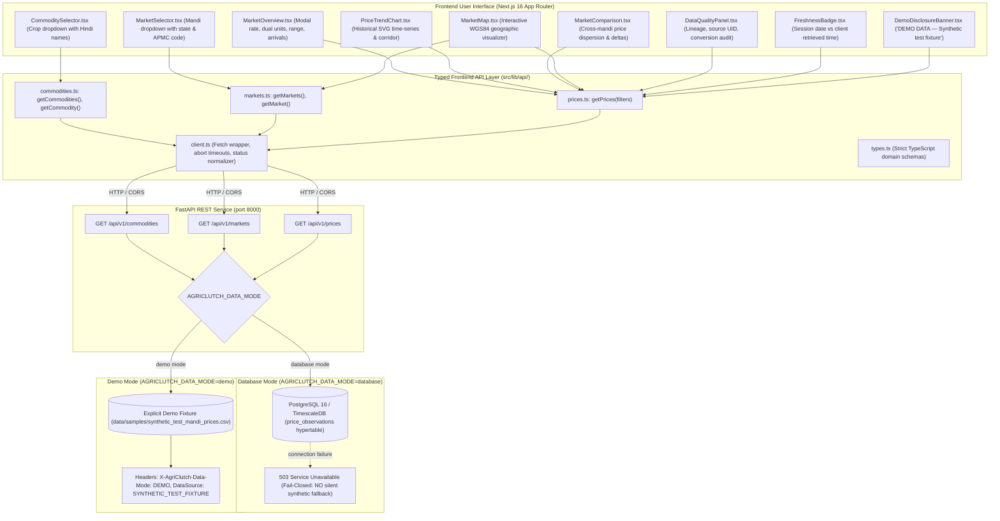

# AgriClutch: Dashboard Data Flow & Frontend-Backend Integration Architecture

> **Document Type**: Technical Specification & Data Flow Guide  
> **Problem Statement**: SIH26132 — Strengthening Market Linkages and Price Discovery for Farmers  
> **Platform**: AgriClutch — AI-Powered Agricultural Market Intelligence & Optimal Selling Platform  
> **Version**: 1.0.0  

---

## 1. Executive Summary & Flow Topology

The AgriClutch dashboard bridges physical agricultural marketplace transactions with interactive decision-support intelligence. It consumes clean-room REST API endpoints served by the FastAPI backend, utilizing a strictly typed TypeScript client layer to present historical APMC mandi trading records, dual-unit pricing, regional price dispersion, and geographic corridor topology.



---

## 2. API Endpoints Consumed by Dashboard

The frontend interacts with versioned REST endpoints adhering to the canonical data contracts:

### 2.1 Commodities Endpoint: `GET /api/v1/commodities`
- **Query Parameters**:
  - `category` *(optional, string)*: Filter by `perishable`, `semi_perishable`, `storable`, `cereal`, `pulse`.
- **Response**: Array of `Commodity` objects:
  ```json
  [
    {
      "id": "tomato",
      "name": "Tomato",
      "hindi_name": "टमाटर",
      "category": "perishable",
      "default_spoilage_rate": 0.08,
      "max_ambient_holding_days": 4,
      "standard_moisture_pct": 94.0,
      "price_unit": "INR_PER_KG",
      "weight_unit": "KG",
      "created_at": "2024-09-15T00:00:00Z"
    }
  ]
  ```
- **Dashboard Usage**: Populates [`CommoditySelector`](file:///c:/Users/shubh/OneDrive/Documents/agriclutch/frontend/src/components/dashboard/CommoditySelector.tsx) with crop cards, vernacular Hindi script, and shelf-life constraints.

### 2.2 Markets Endpoint: `GET /api/v1/markets`
- **Query Parameters**:
  - `state` *(optional, string)*: Filter by state name (e.g., `"Punjab"`, `"Haryana"`, `"Chandigarh"`, `"Delhi"`).
  - `is_terminal` *(optional, boolean)*: Filter by terminal market status.
- **Response**: Array of `Market` objects:
  ```json
  [
    {
      "id": "mandi_ch_49",
      "apmc_code": 49,
      "name": "Chandigarh (APMC)",
      "state": "Chandigarh",
      "district": "Chandigarh",
      "latitude": 30.7333,
      "longitude": 76.7794,
      "is_terminal_market": false,
      "source_market_id": "Chandigarh(Grain)",
      "created_at": "2024-09-15T00:00:00Z"
    }
  ]
  ```
- **Dashboard Usage**: Populates [`MarketSelector`](file:///c:/Users/shubh/OneDrive/Documents/agriclutch/frontend/src/components/dashboard/MarketSelector.tsx) with state tabs and [`MarketMap`](file:///c:/Users/shubh/OneDrive/Documents/agriclutch/frontend/src/components/dashboard/MarketMap.tsx) with geographic geodetic nodes.

### 2.3 Prices Endpoint: `GET /api/v1/prices`
- **Query Parameters**:
  - `commodity` *(optional, string)*: Slug ID (e.g., `"tomato"`).
  - `market` *(optional, string)*: Canonical mandi ID (e.g., `"mandi_ch_49"`).
  - `start_date` *(optional, YYYY-MM-DD)*: Start date filter.
  - `end_date` *(optional, YYYY-MM-DD)*: End date filter.
  - `limit` *(default: 100)*, `offset` *(default: 0)*.
- **Response Headers**:
  - `X-Total-Count`: Total matched observations count.
  - `X-AgriClutch-Data-Mode`: `DEMO` (when `AGRICLUTCH_DATA_MODE=demo`) or `DATABASE` (when querying PostgreSQL).
  - `X-AgriClutch-DataSource`: `SYNTHETIC_TEST_FIXTURE` or `POSTGRESQL`.
- **Response Payload**:
  ```json
  [
    {
      "observation_id": "00000000-0000-0000-0000-000000000002",
      "source_name": "SYNTHETIC_DEMO",
      "source_record_id": "SYN_002",
      "source_market_id": "Chandigarh",
      "source_commodity_id": "Tomato",
      "market_id": "mandi_ch_49",
      "commodity_id": "tomato",
      "record_date": "2024-09-11",
      "variety": "Common",
      "grade": "FAQ",
      "original_modal_price": 2850.0,
      "original_min_price": 2600.0,
      "original_max_price": 3100.0,
      "original_price_unit": "Rs/Quintal",
      "normalized_modal_price": 28.50,
      "normalized_min_price": 26.00,
      "normalized_max_price": 31.00,
      "normalized_price_unit": "INR_PER_KG",
      "arrival_tonnes": 40.0,
      "is_interpolated": false,
      "is_outlier": false,
      "created_at": "2024-09-15T00:00:00Z"
    }
  ]
  ```

---

## 3. Dual-Unit Price Provenance

In Indian agricultural mandis, prices are commonly quoted in **Rupees per Quintal (₹/Quintal)** where $1\text{ Quintal} = 100\text{ kg}$. To provide clarity to farmers without destroying external source provenance:
1. **Source Preservation**:
   - `original_modal_price`: $2850.00$
   - `original_price_unit`: `"Rs/Quintal"`
2. **Canonical Normalization**:
   - $P_{\text{kg}} = P_{\text{quintal}} / 100.0$
   - `normalized_modal_price`: $28.50$
   - `normalized_price_unit`: `"INR_PER_KG"`
3. **UI Display Pattern**:
   - Primary headline rate: **₹28.50 / kg**
   - Secondary source disclosure: *(₹2,850 / Quintal)*

---

## 4. Freshness Semantics & Explicit Demo Disclosure

AgriClutch enforces an uncompromising anti-deception policy:
- **Separation of Freshness Dimensions**:
  - **Empirical Trading Freshness (`record_date`)**: Physical mandi transaction date recorded in historical records (e.g., `11 Sep 2024`).
  - **Demo Fixture Freshness (`retrievedAt`)**: Client-side timestamp when the offline test fixture was loaded.
- **Strictly Prohibited Terminology**:
  - Demo data is **NEVER** labeled as `"live"`, `"real-time"`, `"verified APMC feed"`, `"genuine market observation"`, or `"current market price"`.
- **Prominent Frontend Disclosure**:
  - **In Demo Mode (`AGRICLUTCH_DATA_MODE=demo`)**: Displays a high-visibility amber disclosure banner:
    ```
    ⚠️ DEMO DATA — Synthetic test fixture
    These values are synthetic test observations used for offline benchmarking and interface testing.
    They do not represent current, live, or empirical agricultural market transactions.
    ```
  - **In Database Mode (`AGRICLUTCH_DATA_MODE=database`)**: Accurately labeled as:
    ```
    🏛️ Historical APMC Mandi Records
    Archival empirical records from PostgreSQL / TimescaleDB agricultural database.
    ```

---

## 5. UI Component Behavior & Architecture

| Component | File | Responsibilities & UI Features |
| :--- | :--- | :--- |
| **CommoditySelector** | `CommoditySelector.tsx` | Dynamically renders available crops with emojis, Hindi vernacular names, category tags, and ambient holding day limits. |
| **MarketSelector** | `MarketSelector.tsx` | Displays mandis with state filtering tabs, district names, APMC codes, and terminal market indicators. |
| **MarketOverview** | `MarketOverview.tsx` | Hero card displaying normalized modal rate, source rate, session price spread corridor, daily arrivals, shelf-life constraints, and freshness badge. |
| **PriceTrendChart** | `PriceTrendChart.tsx` | SVG time-series chart rendering modal rate line, min-max corridor shaded area, date labels, and interactive tooltips. |
| **MarketComparison** | `MarketComparison.tsx` | Cross-mandi table comparing latest prices for the selected crop, calculating relative delta ($\pm ₹/kg$ and $\%$) vs selected mandi. |
| **MarketMap** | `MarketMap.tsx` | Geodetic SVG coordinate map plotting Chandigarh, Panchkula, Kalka, Patiala, and Delhi Azadpur corridor with click-to-select. |
| **DataQualityPanel** | `DataQualityPanel.tsx` | Audit panel displaying source system name, record UID, unit conversion formula, interpolation flag, and MAD anomaly check. |
| **FreshnessBadge** | `FreshnessBadge.tsx` | Badges distinguishing `DEMO DATA — Synthetic test fixture` vs `Historical APMC Mandi Records`. |
| **StatusState** | `StatusState.tsx` | Standardized `LoadingState`, `EmptyState`, and `ErrorState` with retry triggers. |

---

## 6. Error Handling & Fail-Closed Integrity Architecture

1. **Network Disconnection**:
   - If the FastAPI server is unreachable, `apiClient` throws `ApiClientError` with status `0` and detail `"NETWORK_ERROR"`.
   - The UI catches this and renders an `ErrorState` card with a "Retry Request" button, without fabricating placeholder numbers.
2. **Fail-Closed Database Mode**:
   - In standard production mode (`AGRICLUTCH_DATA_MODE=database`), if PostgreSQL or TimescaleDB is unreachable, endpoints raise `503 Service Unavailable`.
   - **Zero Silent Substitution**: The system strictly **fails closed** and does **not** silently substitute synthetic data in place of real or historical database queries.
3. **Explicit Demo Mode**:
   - Only when `AGRICLUTCH_DATA_MODE=demo` is explicitly configured in environment variables does the backend serve `data/samples/synthetic_test_mandi_prices.csv`.
   - Every demo response attaches headers `X-AgriClutch-Data-Mode: DEMO` and `X-AgriClutch-DataSource: SYNTHETIC_TEST_FIXTURE`.
4. **Empty Observations**:
   - If no transactions occurred for a specific crop/mandi combination, `EmptyState` displays: *"No observations available for this selection."*

---

## 7. Local Development & Verification Execution

### Running the Full Stack:

```bash
# Terminal 1: Backend API Service (Demo Mode)
cd backend
$env:AGRICLUTCH_DATA_MODE="demo"
python -m uvicorn app.main:app --host 127.0.0.1 --port 8000 --reload

# Terminal 2: Next.js Frontend Application
cd frontend
npm run dev
# Accessible at http://localhost:3000
```

### Verification Commands:
```bash
# Frontend Verification
cd frontend
npm run lint          # ESLint 9 check (0 errors)
npx tsc --noEmit      # TypeScript strict typecheck (0 errors)
npm test              # Node native test runner (8/8 tests passing)
npm run build         # Next.js production build (Turbopack compile success)

# Backend Verification
cd backend
python -m pytest tests -v                                    # 31/31 passing
ruff check --config pyproject.toml . ../pipeline/            # All checks passed
mypy --config-file pyproject.toml app/ ../pipeline/          # 0 issues (48 files)
python -m compileall app ../pipeline/                        # Clean compilation
```
