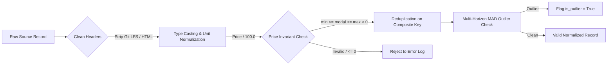

# AgriClutch: Canonical Agricultural Data Contract Specification

> **Document Type**: Data Contract & Schema Specification  
> **Problem Statement**: SIH26132 — Strengthening Market Linkages and Price Discovery for Farmers  
> **Version**: 1.0.0 (Strictly Typed Pydantic v2 & PostgreSQL 16 DDL Aligned)

---

## 1. Scope & Design Philosophy

This document defines the authoritative, system-wide **Canonical Data Contracts** for AgriClutch. All upstream data ingestion adapters (Agmarknet, DCA, state APMC portals, benchmark demo seeds) MUST transform disparate source payloads into these canonical structures before persistence or downstream consumption.

### Principles:
1. **Single Source of Unit Truth**: All internal pricing calculations operate strictly in **Indian Rupees per Kilogram (`INR/kg`)**. Source data quoted in ₹/quintal is converted during the normalization stage ($P_{\text{kg}} = P_{\text{quintal}} / 100.0$).
2. **Deterministic Typing**: Every field has explicit types, boundaries (`gt=0`, `ge=0`), and default behaviors. Untyped dictionaries or dynamic JSON blobs are strictly prohibited in core analytics pipelines.
3. **Immutability & Auditability**: Historical price observations are immutable timeseries events. Every record retains provenance metadata (`data_source`, `is_interpolated`, `ingested_at`).

---

## 2. Canonical Entity Schemas

### 2.1 Commodity Master Schema (`Commodity`)

Represents agricultural produce types tracked by the platform.

```python
from enum import Enum
from pydantic import BaseModel, Field, ConfigDict

class CropCategory(str, Enum):
    PERISHABLE = "perishable"          # Tomato, Leafy Greens
    SEMI_PERISHABLE = "semi_perishable" # Onion, Garlic, Ginger
    STORABLE = "storable"              # Potato
    CEREAL = "cereal"                  # Wheat, Paddy, Maize
    PULSE = "pulse"                    # Gram, Arhar, Moong

class Commodity(BaseModel):
    model_config = ConfigDict(frozen=True)

    id: str = Field(..., description="Unique alphanumeric slug, e.g., 'tomato', 'onion', 'potato'")
    name: str = Field(..., min_length=2, max_length=64, description="Standardized English display name")
    hindi_name: str = Field(..., description="Vernacular name in Devanagari script, e.g., 'टमाटर'")
    category: CropCategory = Field(..., description="Perishability classification")
    default_spoilage_rate: float = Field(..., ge=0.0, le=1.0, description="Daily exponential decay delta at ambient temperature")
    max_ambient_holding_days: int = Field(..., ge=0, le=365, description="Maximum days safe to store without refrigeration")
    standard_moisture_pct: float = Field(..., ge=0.0, le=100.0, description="Standard Fair Average Quality (FAQ) moisture content percentage")
    price_unit: str = Field(default="INR_PER_KG", description="Standard pricing unit")
    weight_unit: str = Field(default="KG", description="Standard weight unit")
```

#### JSON Representation Example:
```json
{
  "id": "tomato",
  "name": "Tomato",
  "hindi_name": "टमाटर",
  "category": "perishable",
  "default_spoilage_rate": 0.08,
  "max_ambient_holding_days": 4,
  "standard_moisture_pct": 94.0,
  "price_unit": "INR_PER_KG",
  "weight_unit": "KG"
}
```

---

### 2.2 Market (Mandi) Master Schema (`Market`)

Represents physical APMC mandis, terminal markets, and aggregation yards.

```python
class Market(BaseModel):
    model_config = ConfigDict(frozen=True)

    id: str = Field(..., description="Canonical AgriClutch identifier derived deterministically (e.g. 'mandi_ch_49')")
    apmc_code: int = Field(..., gt=0, description="Official Agmarknet APMC center code")
    name: str = Field(..., min_length=2, max_length=128, description="Standardized mandi name, e.g., 'Chandigarh'")
    state: str = Field(..., min_length=2, max_length=64, description="Indian State or Union Territory")
    district: str = Field(..., min_length=2, max_length=64, description="District name")
    latitude: float = Field(..., ge=8.0, le=37.5, description="WGS84 latitude within Indian territory")
    longitude: float = Field(..., ge=68.5, le=97.5, description="WGS84 longitude within Indian territory")
    is_terminal_market: bool = Field(default=False, description="True if high-volume interstate destination market")
    dca_centre_id: int | None = Field(default=None, description="Department of Consumer Affairs reporting center mapping")
    source_market_id: str | None = Field(default=None, description="Raw external market identifier from upstream source")
```

#### JSON Representation Example:
```json
{
  "id": "mandi_ch_49",
  "apmc_code": 49,
  "name": "Chandigarh",
  "state": "Chandigarh",
  "district": "Chandigarh",
  "latitude": 30.7333,
  "longitude": 76.7794,
  "is_terminal_market": true,
  "dca_centre_id": 14,
  "source_market_id": "Chandigarh(Grain)"
}
```

---

### 2.3 Market Price Observation Schema (`PriceObservation`)

Represents a single daily price record for a commodity at an APMC mandi, with full provenance and dual pricing (original source values preserved alongside normalized canonical rates).

```python
from uuid import UUID, uuid4
from datetime import date, datetime
from pydantic import BaseModel, Field, model_validator

class PriceObservation(BaseModel):
    observation_id: UUID = Field(default_factory=uuid4, description="Surrogate primary key")
    
    # Provenance & Source Identifiers
    source_name: str = Field(..., description="Source origin: 'AGMARKNET_API', 'DCA_FEED', 'DEMO_BENCHMARK_SEED', 'LOCAL_CSV'")
    source_record_id: str | None = Field(default=None, description="Original record ID from source system if available")
    source_market_id: str = Field(..., description="Raw external market identifier emitted by source")
    source_commodity_id: str = Field(..., description="Raw external commodity identifier emitted by source")

    # Canonical Foreign Keys
    market_id: str = Field(..., description="Canonical mandi master identifier reference")
    commodity_id: str = Field(..., description="Canonical commodity identifier reference")
    record_date: date = Field(..., description="Trading session date (YYYY-MM-DD)")
    variety: str = Field(default="Common", max_length=64, description="Crop cultivar / variety name (non-null default)")
    grade: str = Field(default="FAQ", max_length=16, description="Commercial grade (non-null default)")

    # Original Source Observation (Auditable & Immutable)
    original_modal_price: float = Field(..., gt=0.0, description="Raw unscaled modal price as reported")
    original_min_price: float = Field(..., gt=0.0, description="Raw unscaled minimum price as reported")
    original_max_price: float = Field(..., gt=0.0, description="Raw unscaled maximum price as reported")
    original_price_unit: str = Field(..., description="Source price unit, e.g., 'Rs/Quintal', 'INR_PER_QUINTAL', 'INR_PER_KG'")

    # Normalized Canonical Observation (Standardized for Analytics)
    normalized_modal_price: float = Field(..., gt=0.0, description="Canonical modal price in INR/kg")
    normalized_min_price: float = Field(..., gt=0.0, description="Canonical minimum price in INR/kg")
    normalized_max_price: float = Field(..., gt=0.0, description="Canonical maximum price in INR/kg")
    normalized_price_unit: str = Field(default="INR_PER_KG", description="Canonical currency per unit (always INR_PER_KG)")

    # Volume & Quality Metadata
    arrival_tonnes: float = Field(default=0.0, ge=0.0, description="Reported daily arrival volume in metric tonnes")
    is_interpolated: bool = Field(default=False, description="True if filled via monotonic gap interpolation")
    is_outlier: bool = Field(default=False, description="True if flagged by multi-horizon MAD outlier filter")
    created_at: datetime = Field(default_factory=datetime.utcnow, description="UTC ingestion timestamp")

    @model_validator(mode="after")
    def validate_price_bounds(self) -> "PriceObservation":
        # Check original price hierarchy
        if not (self.original_min_price <= self.original_modal_price <= self.original_max_price):
            raise ValueError(
                f"Original price invariant violated: min ({self.original_min_price}) <= "
                f"modal ({self.original_modal_price}) <= max ({self.original_max_price})"
            )
        # Check normalized price hierarchy
        if not (self.normalized_min_price <= self.normalized_modal_price <= self.normalized_max_price):
            raise ValueError(
                f"Normalized price invariant violated: min ({self.normalized_min_price}) <= "
                f"modal ({self.normalized_modal_price}) <= max ({self.normalized_max_price})"
            )
        return self
```

#### JSON Representation Example:
```json
{
  "observation_id": "550e8400-e29b-41d4-a716-446655440000",
  "source_name": "DEMO_BENCHMARK_SEED",
  "source_record_id": "REC_20240915_001",
  "source_market_id": "Chandigarh(Grain)",
  "source_commodity_id": "Tomato",
  "market_id": "mandi_ch_49",
  "commodity_id": "tomato",
  "record_date": "2024-09-15",
  "variety": "Common",
  "grade": "FAQ",
  "original_modal_price": 2850.0,
  "original_min_price": 2500.0,
  "original_max_price": 3200.0,
  "original_price_unit": "Rs/Quintal",
  "normalized_modal_price": 28.50,
  "normalized_min_price": 25.00,
  "normalized_max_price": 32.00,
  "normalized_price_unit": "INR_PER_KG",
  "arrival_tonnes": 45.5,
  "is_interpolated": false,
  "is_outlier": false,
  "created_at": "2026-09-16T12:00:00Z"
}
```

---

### 2.4 Market Arrival Observation Schema (`ArrivalObservation`)

Dedicated schema for tracking physical arrivals when volume reporting occurs independently of price settlement.

```python
class ArrivalObservation(BaseModel):
    observation_id: UUID = Field(default_factory=uuid4, description="Surrogate primary key")
    source_name: str = Field(..., description="Source origin")
    source_record_id: str | None = Field(default=None)
    source_market_id: str = Field(..., description="Raw external market identifier")
    source_commodity_id: str = Field(..., description="Raw external commodity identifier")
    market_id: str = Field(..., description="Canonical mandi reference")
    commodity_id: str = Field(..., description="Canonical commodity reference")
    record_date: date = Field(..., description="Date of market arrival")
    arrival_tonnes: float = Field(..., ge=0.0, description="Physical inflow in metric tonnes")
    original_arrival_unit: str = Field(default="Tonnes", description="Unit as reported")
    normalized_arrival_unit: str = Field(default="METRIC_TONNE", description="Canonical unit")
    truck_count_estimate: int | None = Field(default=None, ge=0, description="Estimated vehicle arrivals")
    created_at: datetime = Field(default_factory=datetime.utcnow)
```

---

### 2.5 Buyer Profile & Active Demand Schemas

```python
from uuid import UUID

class BuyerType(str, Enum):
    RETAIL_CHAIN = "retail_chain"
    FOOD_PROCESSOR = "food_processor"
    MANDI_WHOLESALER = "mandi_wholesaler"
    EXPORTER = "exporter"
    FPO_AGGREGATOR = "fpo_aggregator"

class BuyerProfile(BaseModel):
    id: UUID = Field(..., description="Unique buyer UUID")
    name: str = Field(..., min_length=2, max_length=128)
    buyer_type: BuyerType
    location: str = Field(...)
    latitude: float = Field(..., ge=8.0, le=37.5)
    longitude: float = Field(..., ge=68.5, le=97.5)
    reliability_score: float = Field(..., ge=0.0, le=1.0, description="Historical fulfillment and payment integrity score")
    dispute_rate: float = Field(..., ge=0.0, le=1.0, description="Percentage of lots rejected or disputed")
    payment_delay_days: int = Field(..., ge=0, description="Average business days to disburse payment")
    provides_pickup: bool = Field(default=True, description="True if buyer arranges farmgate logistics")

class BuyerDemand(BaseModel):
    id: UUID = Field(..., description="Unique demand order UUID")
    buyer_id: UUID = Field(..., description="Associated buyer UUID")
    commodity_id: str = Field(..., description="Crop required")
    required_grade: str = Field(default="FAQ")
    max_quantity_kg: float = Field(..., gt=0.0)
    offered_price_per_kg: float = Field(..., gt=0.0, description="Firm offered rate in INR/kg")
    valid_until: datetime = Field(..., description="Order expiration timestamp")
    is_active: bool = Field(default=True)
```

---

### 2.6 Directed Lead-Lag Edge Schema (`LeadLagEdge`)

Represents empirical transmission elasticity between mandis.

```python
class LeadLagEdge(BaseModel):
    source_market_id: str = Field(..., description="Origin / upstream market")
    target_market_id: str = Field(..., description="Destination / downstream market")
    commodity_id: str = Field(...)
    lag_days: int = Field(..., description="Optimal lead/lag delay in calendar days")
    correlation_coefficient: float = Field(..., ge=-1.0, le=1.0, description="Pearson cross-correlation at optimal lag")
    p_value: float = Field(..., ge=0.0, le=1.0, description="Statistical significance")
    lookback_window_days: int = Field(default=90, description="Rolling historical window evaluated")
    calculated_at: datetime = Field(default_factory=datetime.utcnow)
```

---

## 3. Data Normalization & Cleaning Invariants



### 3.1 Unit Conversion Standard
- **Source Agmarknet Wholesale**: Stated in **₹ / Quintal**.
  $$\text{Price}_{\text{INR/kg}} = \frac{\text{Price}_{\text{INR/quintal}}}{100.0}$$
- **Source Agmarknet Arrivals**: Stated in **Metric Tonnes (MT)**.
  $$\text{Weight}_{\text{kg}} = \text{Arrival}_{\text{tonnes}} \times 1000.0$$
- **Source DCA Retail**: Stated in **₹ / kg** (retained without scalar conversion).

### 3.2 Missing Value & Forward-Fill Policy
1. In raw Agmarknet tabular dumps, market names are emitted solely on the initial row of a group. The normalization adapter MUST perform deterministic forward-filling (`ffill`) of mandi identifiers across sub-rows.
2. If `record_date` is omitted, the record is unrecoverable and MUST be rejected.
3. Market closure days (Sundays, gazetted holidays, APMC strikes) reporting `0, 0, 0` prices are excluded from time-series price indices and flagged as `is_market_closed: true`.

### 3.3 Observation Identity & Deduplication Policy
- **Primary Key**: `observation_id` (UUID surrogate key) ensures stable row referencing and foreign key integrity without fragile composite cascades.
- **Natural Observation Identity**: Uniqueness constraint or unique index enforced over:
  $$\text{Natural Identity} = (\text{record_date}, \text{market_id}, \text{commodity_id}, \text{COALESCE}(\text{variety}, \text{'Common'}), \text{COALESCE}(\text{grade}, \text{'FAQ'}))$$
- **Deduplication Resolution**: If duplicate rows occur within a batch (e.g., the triplicate rows observed in raw research files), the pipeline retains the record with the latest ingestion timestamp, or computes the arithmetic mean if timestamp is identical, logging a `WARNING` or `DUPLICATE` event in the `ValidationReport`.

### 3.4 Multi-Horizon Median Absolute Deviation (MAD) Policy
Price volatility anomalies are evaluated using robust rolling MAD statistics across three horizons ($H \in \{7, 30, 365\}$ days):
$$\text{MAD}_H = \text{median}(|P_t - \text{median}_{t \in H}(P)|)$$
$$\text{Score}_t = \frac{|P_t - \text{median}_H(P)|}{1.4826 \times \text{MAD}_H}$$
A record is flagged `is_outlier = True` if $\text{Score}_t > k_{\text{crop}}$, where $k_{\text{tomato}}=2.25$, $k_{\text{onion}}=2.00$, $k_{\text{potato}}=1.75$. Outliers are preserved in the raw hypertable for auditability but filtered or clamped during model context ingestion.
