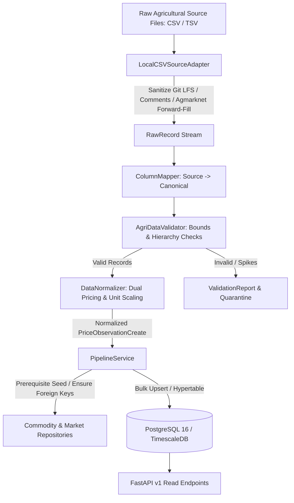
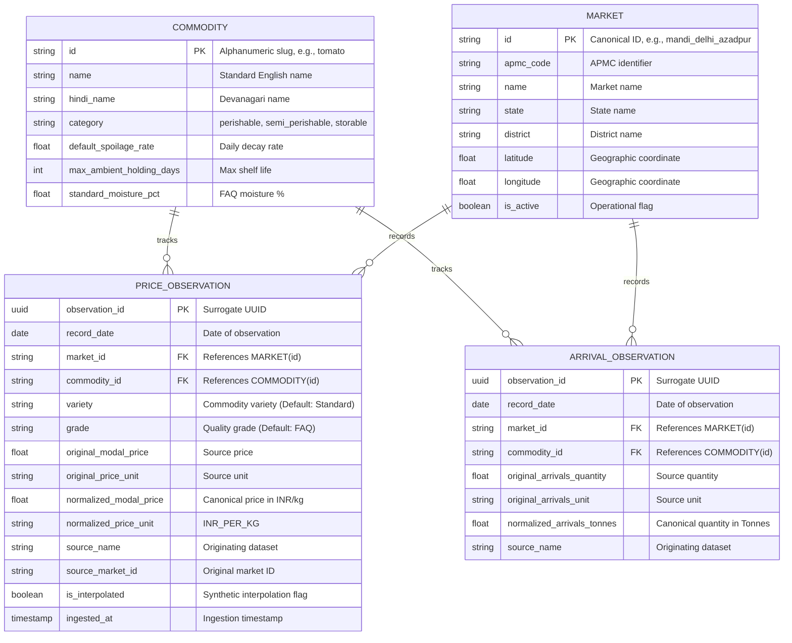

# AgriClutch: Agricultural Data Pipeline Architecture & Specification

> **Document Type**: Technical Specification & Operational Playbook  
> **Problem Statement**: SIH26132 — Strengthening Market Linkages and Price Discovery for Farmers  
> **Version**: 1.0.0  
> **Package**: `pipeline/` & `backend/app/`  

---

## 1. Executive Summary & Design Principles

The AgriClutch Agricultural Data Pipeline is the ingestion, validation, normalization, and persistence backbone of the platform. It translates heterogeneous, uncleaned, and fragmented market observations from varied Indian agricultural sources (such as Agmarknet, DCA, state APMC portals, and benchmark seed datasets) into strictly validated, deterministically normalized, auditable time-series records.



### Prime Architectural Directives
1. **Clean-Room Implementation**: Completely decoupled from research repositories. Zero code contamination.
2. **Deterministic Market Identity**: No hard-coded arbitrary mappings. Market IDs are derived from an authoritative canonical registry (`AuthoritativeMarketRegistry`), with original external IDs explicitly preserved as `source_market_id`.
3. **Auditable Dual Pricing Provenance**: Normalization converts `Rs/Quintal` to canonical `INR/kg` ($P_{\text{kg}} = P_{\text{quintal}} / 100.0$), but **never destroys source values**. Both original (`original_modal_price`, `original_price_unit`) and normalized (`normalized_modal_price`, `normalized_price_unit`) values are persisted.
4. **Surrogate Primary Key with Natural Uniqueness**: Timeseries observations employ a surrogate `observation_id` (UUID) primary key, combined with an invariant composite natural uniqueness constraint over `(record_date, market_id, commodity_id, variety, grade)`.
5. **Decoupled Business Logic**: Ingestion, validation, and normalization are purely numerical and stateless, completely decoupled from downstream ML forecasting (Chronos-2) and decision optimization.

---

## 2. Ingestion Subsystem (`pipeline/ingestion/`)

### 2.1 Raw Record Abstraction (`pipeline/ingestion/base.py`)
All source adapters yield a typed `RawRecord` abstraction containing the row data, line number, source file name, and ingestion timestamp:

```python
@dataclass
class RawRecord:
    row_number: int
    data: dict[str, Any]
    source_file: str
    ingested_at: datetime
```

### 2.2 Robust CSV Adapter (`pipeline/ingestion/csv_adapter.py`)
Empirical agricultural datasets frequently contain formatting anomalies. `LocalCSVSourceAdapter` handles real-world edge cases:
- **Git LFS Artifact & Header Sanitization**: Detects and skips Git merge conflict markers (`<<<<<<< HEAD`, `=======`, `>>>>>>>`) and comment lines starting with `#`.
- **Stateful Forward-Fill (Agmarknet Hierarchy)**: In Agmarknet portal exports, the `State` and `District` columns are only populated on the first row of each group, leaving subsequent rows blank. The adapter maintains state and forward-fills these hierarchical fields until a new state or district appears.
- **Delimiter Detection**: Inspects delimiter signatures (`comma` vs. `tab`).

### 2.3 Source Column Mapping (`pipeline/ingestion/column_mapper.py`)
`ColumnMapper` standardizes disparate column naming conventions across sources:
- **Agmarknet Source**: Maps `Price Date` $\to$ `record_date`, `Market` $\to$ `market_name`, `Modal Price (Rs./Quintal)` $\to$ `modal_price`, `Arrivals (Tonnes)` $\to$ `arrivals_quantity`.
- **Benchmark Demo Source**: Maps `date` $\to$ `record_date`, `mandi` $\to$ `market_name`, `modal_price` $\to$ `modal_price`, `arrivals` $\to$ `arrivals_quantity`.
- **DCA Retail Source**: Maps `Date` $\to$ `record_date`, `Centre` $\to$ `market_name`, `Retail Price` $\to$ `modal_price`.

---

## 3. Authoritative Market Identity (`pipeline/ingestion/market_resolver.py`)

To prevent arbitrary market ID invention, AgriClutch maintains an authoritative registry of known APMC and terminal markets.

| Market ID | Canonical Name | State | District | APMC Code | Latitude | Longitude |
| :--- | :--- | :--- | :--- | :--- | :--- | :--- |
| `mandi_delhi_azadpur` | Azadpur (Delhi - Terminal) | Delhi | North Delhi | `DL-01-AZADPUR` | 28.7161 | 77.1706 |
| `mandi_chandigarh_chd` | Chandigarh (Grain/APMC) | Chandigarh | Chandigarh | `CH-01-GRAIN` | 30.7333 | 76.7794 |
| `mandi_punjab_patiala` | Patiala (Punjab) | Punjab | Patiala | `PB-12-PATIALA` | 30.3398 | 76.3869 |
| `mandi_haryana_panchkula` | Panchkula (Haryana) | Haryana | Panchkula | `HR-01-PANCHKULA` | 30.6942 | 76.8606 |
| `mandi_haryana_kalka` | Kalka (Haryana) | Haryana | Panchkula | `HR-02-KALKA` | 30.8333 | 76.9333 |

### Canonicalization Algorithm:
When a record arrives:
1. Exact match against known aliases in `AuthoritativeMarketRegistry`.
2. Cleaned name matching (stripping punctuation, casing, APMC/Grain suffixes).
3. If an unrecognized market appears, a deterministic, slugified canonical ID is generated:
   $$\text{canonical\_id} = \text{"mandi\_"} + \text{slugify}(\text{state}) + \text{"\_"} + \text{slugify}(\text{market\_name})$$
4. The external identifier is always stored separately in `source_market_id`.

---

## 4. Validation Subsystem (`pipeline/validation/`)

The `AgriDataValidator` runs multi-attribute syntactic and semantic health checks on mapped records before normalization.

### 4.1 Validation Rules
1. **Mandatory Fields**: `record_date`, `commodity`, `market_name`, and `modal_price` must be present.
2. **Date Parseability**: Supports ISO `YYYY-MM-DD`, Indian `DD/MM/YYYY`, and dash-separated `DD-Mon-YYYY`. Rejects future dates.
3. **Price Bounds**:
   - $\text{Price} > 0.0$ (strictly positive; zero or negative prices rejected).
   - $\text{Price} \le 100,000.0$ (flags extreme entry anomalies).
4. **Price Hierarchy Consistency**:
   $$\text{min\_price} \le \text{modal\_price} \le \text{max\_price}$$
   Violations where $\text{min\_price} > \text{modal\_price}$ or $\text{modal\_price} > \text{max\_price}$ are rejected.
5. **Arrival Bounds**:
   - $\text{Arrivals} \ge 0.0$ (non-negative).
6. **Duplicate Detection**:
   Identifies duplicate rows within the same batch sharing identical $(date, market, commodity, variety, grade)$.

### 4.2 Data Health Score Calculation
Every validation batch outputs a quantitative `DataHealthReport`:
$$\text{Health Score} = \max\left(0, 100 - \left(\frac{\text{Invalid Records}}{\text{Total Records}} \times 100\right) - (\text{Warning Count} \times 0.5)\right)$$

---

## 5. Normalization Subsystem (`pipeline/cleaning/`)

The `DataNormalizer` executes deterministic unit scaling and string canonicalization.

### 5.1 Dual Pricing & Unit Scaling
Agricultural markets in India quote prices in either ₹/Quintal (1 Quintal = 100 kg) or ₹/kg. The normalizer applies deterministic conversion:

```python
# Price Scaling Logic
if price_unit.upper() in ("RS/QUINTAL", "RS_PER_QUINTAL", "QUINTAL", "INR/QUINTAL"):
    normalized_price = round(original_price * 0.01, 4)
    normalized_unit = "INR_PER_KG"
elif price_unit.upper() in ("RS/KG", "INR/KG", "KG"):
    normalized_price = round(original_price, 4)
    normalized_unit = "INR_PER_KG"
```

### 5.2 Preservation of Source Provenance
The resulting `PriceObservationCreate` schema guarantees full auditability:
- `original_modal_price`: Raw scalar as reported in source.
- `original_min_price`: Raw min price.
- `original_max_price`: Raw max price.
- `original_price_unit`: Raw unit (e.g., `RS_PER_QUINTAL`).
- `normalized_modal_price`: Converted rate in `INR/kg`.
- `normalized_min_price`: Converted min rate in `INR/kg`.
- `normalized_max_price`: Converted max rate in `INR/kg`.
- `normalized_price_unit`: Canonical unit (`INR_PER_KG`).
- `source_name`: Ingested source identifier.
- `source_record_id`: Upstream source record identifier.
- `source_market_id`: Upstream market identifier.
- `source_commodity_id`: Upstream commodity identifier.

---

## 6. Database Storage & Relational Design (`backend/app/models/`)

### 6.1 Entity Relational Schema



### 6.2 Indexing & TimescaleDB Optimization
- **Surrogate PK**: `observation_id UUID PRIMARY KEY`.
- **Composite Natural Uniqueness Constraint**:
  ```sql
  CONSTRAINT uq_mandi_daily_natural UNIQUE (record_date, market_id, commodity_id, variety, grade)
  ```
- **Compound Performance Indexes**:
  - `ix_prices_mandi_crop_date` on `(market_id, commodity_id, record_date DESC)`
  - `ix_prices_crop_date` on `(commodity_id, record_date DESC)`
  - `ix_prices_record_date` on `(record_date DESC)`
- **TimescaleDB Partitioning**: In PostgreSQL environments with TimescaleDB enabled, `price_observations` is converted into a hypertable partitioned on `record_date`.

---

## 7. CLI Runner & Ingestion Workflow (`pipeline/cli.py`)

The pipeline includes a production-ready command-line tool for local processing, validation reporting, and database synchronization.

### 7.1 Command Usage

```bash
# Dry-run validation and health report output (No database writes)
python -m pipeline.cli --input data/samples/synthetic_test_mandi_prices.csv --source benchmark_demo --dry-run --output-report reports/health_report.json

# Production database ingestion
python -m pipeline.cli --input data/samples/synthetic_test_mandi_prices.csv --source benchmark_demo

# Custom format and batch sizing
python -m pipeline.cli --input data/agmarknet/tomato_2024.csv --source agmarknet --format csv --batch-size 1000
```

### 7.2 CLI Options Reference
- `--input` / `-i`: Path to the raw source data file (`.csv`, `.tsv`).
- `--source` / `-s`: Source identifier (`agmarknet`, `benchmark_demo`, `dca`, `custom`).
- `--format` / `-f`: File format (`csv`, `tsv`). Default: `csv`.
- `--dry-run`: Performs complete parsing, validation, and normalization without writing to the database.
- `--output-report` / `-o`: Destination path to write the JSON `ValidationReport`.
- `--batch-size`: Batch chunking size for bulk database inserts. Default: `1000`.

---

## 8. REST API Read Layer (`backend/app/api/v1/`)

Read-only REST endpoints allow consumers to query canonical commodities, registered markets, and time-series prices.

### 8.1 API Endpoints

#### 1. `GET /api/v1/commodities`
Lists all tracked commodities with perishability classification and shelf-life constants.
- **Parameters**: `category` (optional, filter by `perishable`, `semi_perishable`, `storable`).
- **Response**: Array of `CommodityResponse` objects.

#### 2. `GET /api/v1/markets`
Lists all registered markets with geographic coordinates and APMC codes.
- **Parameters**: `state` (optional), `is_active` (optional, default: `true`).
- **Response**: Array of `MarketResponse` objects.

#### 3. `GET /api/v1/prices`
Queries historical price observations with dual pricing provenance.
- **Parameters**:
  - `commodity_id` (optional): Filter by commodity slug (e.g., `tomato`).
  - `market_id` (optional): Filter by canonical market ID (e.g., `mandi_delhi_azadpur`).
  - `start_date` (optional): Filter start date (`YYYY-MM-DD`).
  - `end_date` (optional): Filter end date (`YYYY-MM-DD`).
  - `limit` (default: 100, max: 1000): Pagination limit.
  - `offset` (default: 0): Pagination offset.
- **Response**: Array of `PriceObservationResponse` objects.

---

## 9. Verification & Automated Test Suite

The pipeline is verified with 28 automated unit and integration tests under `backend/tests/`:

```
backend/tests/
├── conftest.py                          # Mock AsyncSession, test fixtures
├── test_health.py                       # /health and /health/db probes (4 tests)
├── test_database_models.py              # ORM instantiation and dual pricing constraints (4 tests)
├── test_pipeline_ingestion.py           # Git LFS conflict stripping, forward-filling (5 tests)
├── test_pipeline_validation.py          # Hierarchy, bounds, duplicates, health score (7 tests)
├── test_pipeline_normalization.py       # Rs/Quintal scaling, slugification (4 tests)
└── test_api_endpoints.py                # REST API filtering and schemas (4 tests)
```

### Test Suite Execution:
```bash
python -m pytest backend/tests -v
# Output: 28 passed in 0.87s

ruff check --config backend/pyproject.toml backend/ pipeline/
# Output: All checks passed!

mypy --config-file backend/pyproject.toml backend/app/ pipeline/
# Output: Success: no issues found in 46 source files
```
