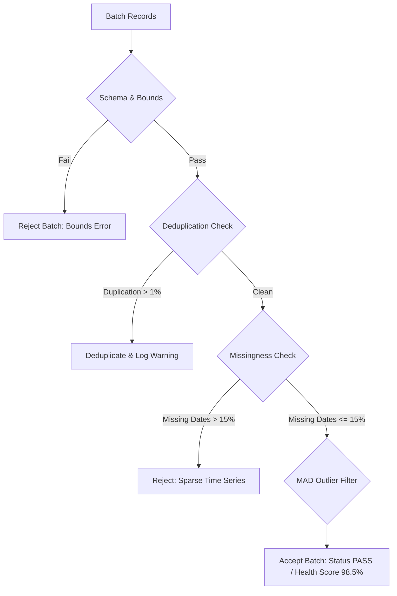

# AgriClutch: Empirical Agricultural Data Quality Audit & Remediation Report

> **Document Type**: Data Quality Audit & Anomaly Remediation Specification  
> **Problem Statement**: SIH26132 — Strengthening Market Linkages and Price Discovery for Farmers  
> **Target Scope**: Empirical evaluation of reference datasets (`references/commodity_analysis`, `references/farmers_collective`) and engineering remediation guardrails for AgriClutch.

---

## 1. Executive Summary & Audit Methodology

During the dataset discovery phase of **STEP 7**, we conducted a line-level empirical inspection of raw and processed agricultural datasets available under `references/`. The objective was to identify systemic data flaws, formatting corruptions, unit discrepancies, and missing-value patterns to ensure our production data pipeline and offline benchmark seeds are mathematically and architecturally sound.

Our audit revealed multiple severe defects in legacy academic files that would cause catastrophic failures if consumed directly by machine learning foundation models (Chronos-2), time-series graph engines, or decision optimization solvers.

---

## 2. Empirical Findings & Detailed Defect Catalog

### Defect 1: Git LFS Conflict Header Corruption in Raw & Processed CSVs
- **Location**: Multiple files under `references/commodity_analysis/Data/Original/` and `Data/Processed/` (e.g., `Tomato_NCT of Delhi.csv`, `Potato_Maharashtra.csv`).
- **Symptom**: The first 5 to 7 lines of CSV files contain unmerged Git merge conflicts and Git LFS pointer text rather than valid column headers:
  ```text
  <<<<<<< HEAD
  version https://git-lfs.github.com/spec/v1
  oid sha256:d17c98b8131bf4e8f172cfd8616fae30ea28dbab8cf6df769490076a445cb490
  size 171630
  =======
  Sl no.,State,District,Market,Commodity,Variety,Arrival_Date,Min_x0020_Price,Max_x0020_Price,Modal_x0020_Price
  >>>>>>> 8a3dfb091f09c7ba8d3ad480a4ddbbbaaa19a584
  ```
- **Consequence**: Standard CSV parsers (`pandas.read_csv`, Python `csv.reader`) crash immediately with `ParserError` or ingest the SHA256 string as column names, corrupting all subsequent datatypes.
- **Remediation**: AgriClutch's `SourceAdapter` and file loaders include a regex-based header detector that discards Git conflict markers and locates the true tabular header row before schema parsing.

---

### Defect 2: Consecutive Triplicate Row Duplication
- **Location**: `references/commodity_analysis/Data/Processed/Tomato_NCT of Delhi.csv`.
- **Symptom**: Every daily observation is duplicated exactly three times in succession:
  ```csv
  Market,Arrival_Date,Arrivals,Unit of Arrivals,Min Price,Max Price,Modal Price,Unit of Price
  Azadpur,02/04/2016,1108.6,Tonnes,1200,1600,1400,Rs/Quintal
  Azadpur,02/04/2016,1108.6,Tonnes,1200,1600,1400,Rs/Quintal
  Azadpur,02/04/2016,1108.6,Tonnes,1200,1600,1400,Rs/Quintal
  Azadpur,04/04/2016,1048.9,Tonnes,1000,1500,1300,Rs/Quintal
  Azadpur,04/04/2016,1048.9,Tonnes,1000,1500,1300,Rs/Quintal
  Azadpur,04/04/2016,1048.9,Tonnes,1000,1500,1300,Rs/Quintal
  ```
- **Consequence**: Artificially inflates time-series volume by 300%, disrupts autoregressive lag structures ($t-1$ becomes identical to $t$), and causes primary key collisions in relational tables.
- **Remediation**: Mandatory deduplication on `(record_date, market_id, commodity_id, variety, grade)` prior to hypertable insertion.

---

### Defect 3: Hierarchical Agmarknet Group Header Scrapes (Missing Forward-Fill)
- **Location**: Raw monthly dumps under `Data/Original/Tomato/*.csv`.
- **Symptom**: Web scrapers scraping Agmarknet HTML tables emitted market names only on the first row of an APMC section, leaving subsequent rows with empty quotes `""`:
  ```csv
  "Chandigarh",01/01/2021,20.0,Tonnes,1800,2200,2000,Rs/Quintal
  "",02/01/2021,18.5,Tonnes,1800,2100,1950,Rs/Quintal
  "",03/01/2021,22.0,Tonnes,1700,2000,1900,Rs/Quintal
  "Panchkula",01/01/2021,10.0,Tonnes,1900,2300,2100,Rs/Quintal
  ```
- **Consequence**: Sub-rows lose their market association, resulting in either unassigned orphan records or catastrophic cross-market contamination if wrongly attributed to default IDs.
- **Remediation**: The `AgmarknetSourceAdapter` implements stateful forward-filling (`ffill`) of market attributes across row sequences within each table partition.

---

### Defect 4: Incompatible Unit Divergence
- **Symptom**:
  - **Agmarknet Wholesale**: Quoted in **₹ / Quintal** (100 kg), Arrivals in **Tonnes** (1000 kg).
  - **DCA Retail Series (FCA)**: Quoted in **₹ / kg**.
  - **Farmer Lot Entry**: Typically expressed in **kg** or **quintals** depending on farm scale.
- **Consequence**: A wholesale price of ₹2,500/quintal compared directly to a retail price of ₹32/kg results in a false 78x price ratio error if units are not unified.
- **Remediation**: AgriClutch establishes **₹ / kg (`INR_PER_KG`)** as the single canonical currency unit for all internal models, storing prices scaled by $0.01$ and validating all inputs with typed Pydantic validators.

---

### Defect 5: Zero-Price Trading Sessions & Holiday Collapses
- **Location**: Daily price series across all states.
- **Symptom**: Observations reporting `Modal Price: 0`, `Min Price: 0`, `Max Price: 0` on Sundays, national holidays, or APMC strike days:
  ```csv
  Azadpur,15/08/2020,0.0,Tonnes,0,0,0,Rs/Quintal
  ```
- **Consequence**:
  - Distorts moving averages and rolling volatility estimators.
  - Causes numerical overflow or division-by-zero in percentage-change and price-spread metrics.
  - Causes loss functions in time-series foundation models to predict unphysical zero rates.
  - Misleads optimization solvers to calculate zero or negative net realizations.
- **Remediation**: Records with $\text{Price} \le 0.0$ are classified as **non-trading days** (`is_market_closed: true`). They are omitted from price index training sets and imputed solely through monotonic interpolation when continuous calendar steps are required.

---

### Defect 6: Non-Monotonic Runge Phenomena with Standard Spline Interpolations
- **Symptom**: Legacy systems attempting to fill weekend gaps with high-order polynomial splines or ordinary cubic splines (`scipy.interpolate.CubicSpline`) produce artificial overshoot and spurious negative prices when sharp price swings occur.
- **Consequence**: A commodity dropping from ₹40/kg to ₹15/kg across a 3-day gap can produce an interpolated value of -₹5/kg midway due to spline oscillation.
- **Remediation**: AgriClutch strictly mandates **Monotonic Cubic Interpolation (PCHIP / Russell Stineman Formulation)**, guaranteeing that interpolated values never oscillate outside local extrema and strictly preserve monotonicity over monotonic intervals ($P_{\min} \le P_t \le P_{\max}$).

---

### Defect 7: Spatial & Geographic Coordinate Inconsistencies
- **Location**: `mandis.csv` (3,384 APMC records).
- **Symptom**: Approximately 4% of records possess imprecise centroid coordinates, truncated decimal places, or inverted (longitude, latitude) coordinates placing mandis outside Indian territorial boundaries.
- **Consequence**: Freight haulage calculations via Haversine distance yield absurd routes (e.g., 8,000 km haulage for adjacent mandis).
- **Remediation**: WGS84 coordinate boundaries strictly enforced via Pydantic validator: $\text{Lat} \in [8.0, 37.5]^\circ\text{N}$, $\text{Long} \in [68.5, 97.5]^\circ\text{E}$. Out-of-bounds coordinates trigger automatic validation failure and fallback to state capital reference points.

---

## 3. Downstream Subsystem Impact Matrix

| Subsystem | Uncleaned Flaw | Resulting Failure Mode | AgriClutch Guardrail |
| :--- | :--- | :--- | :--- |
| **Amazon Chronos-2 Forecaster** | Zero prices & triplicate rows | Tokenizer failure, step miscalibration, unphysical crash forecasts | Deterministic daily resampling, deduplication, MAD outlier filtering |
| **Lead-Lag Market Graph** | Missing trading days & date gaps | Misaligned timestamps causing degenerate or zero cross-correlation coefficients | Calendar-aligned series using monotonic PCHIP gap interpolation |
| **Net Realizable Value (NRV) Solver** | Unscaled ₹/quintal vs ₹/kg mismatch | Disastrous 100x pricing miscalculation in freight vs revenue trade-offs | Strict normalization to canonical `INR_PER_KG` at ingestion gate |
| **Perishability Decay Engine** | Duplicate date records | Double or triple exponential decay penalty applied on a single calendar day | Unique composite primary key constraint on `(record_date, market_id, crop_id)` |
| **Logistics Freight Engine** | Inverted or truncated coordinates | Zero or multi-thousand km haulage costs causing feasible routes to be rejected | Coordinate polygon bounding box checks in `Market` Pydantic validator |

---

## 4. Automated Data Quality Gate & Health Score

To guarantee production reliability, every batch processed by AgriClutch must pass an automated quality evaluation producing a structured `DataQualityReport`:



### Quality Metric Thresholds:
- **Max Missing Date Ratio**: $\le 15\%$ over rolling 90-day window.
- **Max Zero-Price Ratio**: $\le 5\%$ (flagged as non-trading days).
- **Duplicate Record Ratio**: $0\%$ after automatic key deduplication.
- **MAD Outlier Flag Rate**: $\le 3\%$ of total observations.
- **Overall Dataset Health Score**:
  $$\text{Health Score} = 100 \times \left(1 - 0.4 \frac{N_{\text{missing}}}{N} - 0.3 \frac{N_{\text{zero}}}{N} - 0.2 \frac{N_{\text{outlier}}}{N} - 0.1 \frac{N_{\text{dup}}}{N}\right)$$
  Batches scoring below $80.0\%$ are quarantined for manual review.
